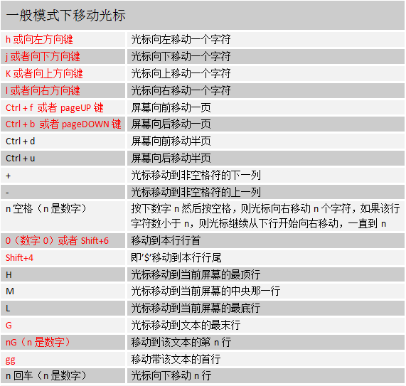
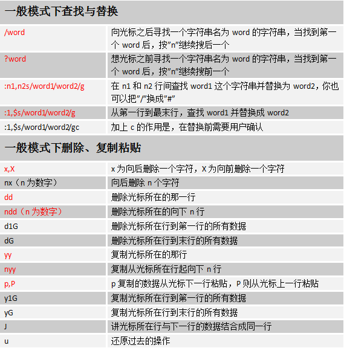
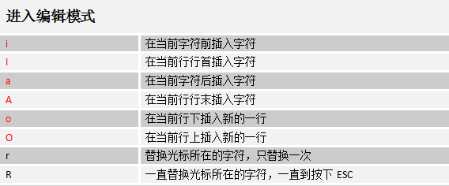
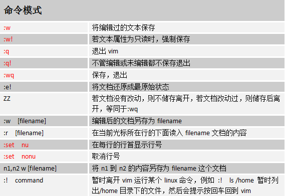

第十章 文本编辑工具vim

# [跟阿铭学linux 2 documentation](index.md)

## 第十章 文本编辑工具vim

&#65533;  [第九章 Linux磁盘管理](chapter9.md)  ::   [Contents](index.md)  ::   [第十一章 文档的压缩与打包](chapter11.md)  &#65533;

# 第十章 文本编辑工具vim

前面多次提到过vi这个命令，它是linux中必不可少的一个工具。没有它很多工作都无法完成。早期的Unix都是使用的vi作为系统默认的编辑器的。您也许会有疑问，vi与vim有什么区别？可以这样简单理解，vim是vi的升级版。很多linux系统管理员都习惯用vi，那是因为他们接触linux的时候用的就是vi，vim后来才比较流行。所以，无所谓用vi和vim，只要您能达到您想要的目的即可。

在阿铭看来vi
和vim最大的区别就是编辑一个文本时，vi不会显示颜色，而vim会显示颜色。显示颜色更易于用户进行编辑。其他功能没有什么区别。所以在linux系统下，使用vi还是vim完全取决您的个人爱好而已。阿铭从一开始学linux就一直使用vim，所以也会一直以vim的角色来教授给您。

也许您刚刚安装的CentOS系统上没有这个命令，请这样安装它 yuminstall-yvim-enhanced

vim的三种模式：一般模式、编辑模式、命令模式。这需要您牢记的，因为以前阿铭刚刚从事linux工作的时候去面试，很多单位的笔试题就有这个知识点。

1. 一般模式： 当您vim filename
  编辑一个文件时，一进入该文件就是一般模式了。在这个模式下，您可以做的操作有，上下移动光标；删除某个字符；删除某行；复制、粘贴一行或者多行。

2. 编辑模式：一般模式下，是不可以修改某一个字符的，只能到编辑模式了。从一般模式进入编辑模式，只需您按一个键即可（i, I, a, A, o, O,
  r, R）。当进入编辑模式时，会在屏幕的最下一行出现“INSERT或REPLACE”的字样。从编辑模式回到一般模式只需要按一下键盘左上方的ESC键即可。

3. 命令模式：在一般模式下，输入 ”:” 或者 “/”
  即可进入命令模式。在该模式下，您可以搜索某个字符或者字符串，也可以保存、替换、退出、显示行号等等。

下面阿铭教您如何在一个空白文档中写入一段文字，然后保存。

    [root@localhost ~]# vim test.txt

输入vim test.txt直接回车进入一般模式。然后按 “i” 字母进入编辑模式，在窗口的左下角会显示 “– 插入 –” 或者 “– INSERT –”
这说明进入插入模式，可以编辑文档。下面阿铭随便写一段文字：

    This is a test file.
    And this is the first time to using "vim".
    It's easy to use "vim".
    I like to using it, do you like it?

如果您编辑完了，想保存的话，需要先按一下键盘左上角的 “Esc” 键，此时 “– 插入 –” 或者 “– INSERT –” 消失，然后输入 ”:wq”
回车就会保存刚才的文字了。

    This is a test file.
    And this is the first time to using "vim".
    It's easy to use "vim".
    I like to using it, do you like it?
    ~
    ~
    :wq

这时，看一下test.txt文档的内容吧:

    [root@localhost ~]# cat test.txt
    This is a test file.
    And this is the first time to using "vim".
    It's easy to use "vim".
    I like to using it, do you like it?

其实 “vim”
为全键盘操作的编辑器，所以在各个模式下都有很多功能键。下面列举一下，其中阿铭认为常用的会用红色标出，需要您多加练习，另外不常用的您也需要知道。

暂时就讲这么多了。如果您能全部掌握，那您一定是vim高手啦。如果您觉得太多，只要记住阿铭标红部分即可，其他的用时再过来查就ok啦。下面阿铭给您留一个小作业，希望您能认真完成！

1. 请把/etc/init.d/iptables 复制到/root/目录下，并重命名为test.txt

2. 用vim打开test.txt并设置行号

3. 分别向下、向右、向左、向右移动5个字符

4. 分别向下、向上翻两页

5. 把光标移动到第49行

6. 让光标移动到行末，再移动到行首

7. 移动到test.txt文件的最后一行

8. 移动到文件的首行

9. 搜索文件中出现的 iptables 并数一下一共出现多少个

10. 把从第一行到第三行出现的iptables 替换成iptable

11. 还原上一步操作

12. 把整个文件中所有的iptables替换成iptable

13. 把光标移动到25行，删除字符 “$”

14. 还原上一步操作

15. 删除第50行

16. 还原上一步操作

17. 删除从37行到42行的所有内容

18. 还原上一步操作

19. 复制48行并粘贴到52行下面

20. 还原上一步操作（按两次u）

21. 复制从37行到42行的内容并粘贴到44行上面

22. 还原上一步操作（按两次u）

23. 把37行到42行的内容移动到19行下面

24. 还原上一步操作（按两次u）

25. 光标移动到首行，把/bin/sh 改成 /bin/bash

26. 在第一行下面插入新的一行，并输入”# Hello!”

27. 保存文档并退出

阿铭建议您最好再扩展学习一下: [http://www.lishiming.net/thread-5434-1-1.md](http://www.lishiming.net/thread-5434-1-1.md)

教程答疑: [请移步这里](http://www.lishiming.net/forum-40-1.md).

欢迎您加入 [阿铭学院](http://www.aminglinux.com)
和阿铭一起学习Linux，让阿铭成为您Linux生涯中永远的朋友吧！

&#65533;  [第九章 Linux磁盘管理](chapter9.md)
  ::   [Contents](index.md)
  ::   [第十一章
文档的压缩与打包](chapter11.md)  &#65533;

&copy; Copyright 2013, lishiming.net. Created using [Sphinx](http://sphinx-doc.org/) 1.2b1.
