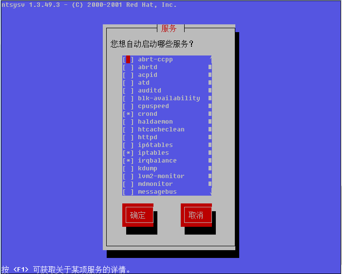

第十六章 linux系统日常管理

# [跟阿铭学linux 2
documentation](index.md)

## 第十六章 linux系统日常管理

&#65533;  [第十五章 shell脚本](chapter15.md)
  ::   [Contents](index.md)
  ::   [第十七章
LAMP环境搭建](chapter17.md)  &#65533;

# 第十六章 linux系统日常管理

阿铭在前面介绍的内容都为linux系统基础类的，如果您现在把前面的内容全部很好的掌握了，那最好了。不过阿铭要说的是，即使您完全掌握了，您现在还是不能作为一名合格的linux系统管理员的，毕竟系统管理员要会做的事情太多了。本章以及后面章节阿铭会陆续教给您作为linux系统管理员所必备的知识。只要您熟练掌握那绝对可以胜任一个最初级的管理员职位，不过只是初级的，因为您还需要在日常的管理工作中获得成长。

## 监控系统的状态

**1. w查看当前系统的负载**

    [root@localhost sbin]# w
     15:23:46 up  3:34,  2 users,  load average: 0.03, 0.05, 0.00
    USER     TTY      FROM              LOGIN@   IDLE   JCPU   PCPU WHAT
    root     tty1     -                12:26    2:55m  0.11s  0.11s -bash
    root     pts/0    10.72.137.53     12:28    1:17m  1:32   1:32  -bash

相信所有的linux管理员最常用的命令就是这个 w
了，该命令显示的信息还是蛮丰富的。第一行从左面开始显示的信息依次为：时间，系统运行时间，登录用户数，平均负载。第二行开始以及下面所有的行，告诉我们的信息是，当前登录的都有哪些用户，以及他们是从哪里登录的等等。其实，在这些信息当中，阿铭认为我们最应该关注的应该是第一行中的
‘load average:’ 后面的三个数值。

第一个数值表示1分钟内系统的平均负载值；第二个数值表示5分钟内系统的平均负载值；第三个数值表示15分钟系统的平均负载值。这个值的意义是，单位时间段内CPU活动进程数。当然这个值越大就说明您的服务器压力越大。一般情况下这个值只要不超过服务器的cpu数量就没有关系，如果服务器cpu数量为8，那么这个值若小于8，就说明当前服务器没有压力，否则就要关注一下了。到这里您肯定会问，如何查看服务器有几个cpu？

    [root@localhost sbin]# cat /proc/cpuinfo
    processor       : 0
    vendor_id       : AuthenticAMD
    cpu family      : 16
    model           : 6
    model name      : AMD Phenom(tm) II N660 Dual-Core Processor
    stepping        : 3
    cpu MHz         : 3000.000
    cache size      : 1024 KB
    fdiv_bug        : no
    hlt_bug         : no
    f00f_bug        : no
    coma_bug        : no
    fpu             : yes
    fpu_exception   : yes
    cpuid level     : 5
    wp              : yes
    flags           : fpu vme de pse tsc msr pae mce cx8 apic sep mtrr pge mca cmov pat pse36 clflush mmx fxsr sse sse2 syscall nx mmxext fxsr_opt rdtscp lm 3dnowext 3dnow constant_tsc up tsc_reliable nonstop_tsc extd_apicid pni cx16 popcnt lahf_lm abm sse4a misalignsse 3dnowprefetch
    bogomips        : 6000.00
    clflush size    : 64
    cache_alignment : 64
    address sizes   : 36 bits physical, 48 bits virtual
    power management: ts ttp tm stc 100mhzsteps hwpstate

‘/proc/cpuinfo’
这个文件记录了cpu的详细信息。目前市面上的服务器通常都是2颗4核cpu，在linux看来，它就是8个cpu。查看这个文件时则会显示8段类似的信息，而最后一段信息中processor
: 后面跟的是 ‘7’ 所以查看当前系统有几个cpu，我们可以使用这个命令： grep-c'processor'/proc/cpuinfo
而如何看几颗物理cpu呢，需要查看关键字 “physical id”, 由于阿铭的虚拟机只有一个cpu所以并未显示关于 “physical id”
的信息。

**2. vmstat 监控系统的状态**

    [root@localhost ~]# vmstat
    procs -----------memory---------- ---swap-- -----io---- --system-- -----cpu-----
     r  b   swpd   free   buff  cache   si   so    bi    bo   in   cs us sy id wa st
     0  0    512   5392  37460 213276    0    0   100   549  153   59  1  4 93  1  0

上面讲的 w 查看的是系统整体上的负载，通过看那个数值可以知道当前系统有没有压力，但是具体是哪里（CPU, 内存，磁盘等）有压力就无法判断了。通过
vmstat 就可以知道具体是哪里有压力。vmstat命令打印的结果共分为6部分：procs, memory, swap, io, system, cpu.
请重点关注一下r b si so bi bo几列。

1）procs 显示进程相关信息

r ：表示运行和等待cpu时间片的进程数，如果长期大于服务器cpu的个数，则说明cpu不够用了；

b ：表示等待资源的进程数，比如等待I/O, 内存等，这列的值如果长时间大于1，则需要关注一下了；

2）memory 内存相关信息

swpd ：表示切换到交换分区中的内存数量 ；

free ：当前空闲的内存数量；

buff ：缓冲大小，（即将写入磁盘的）；

cache ：缓存大小，（从磁盘中读取的）；

3）swap 内存交换情况

si ：由交换区写入到内存的数据量；

so ：由内存写入到交换区的数据量；

4）io 磁盘使用情况

bi ：从块设备读取数据的量（读磁盘）；

bo： 从块设备写入数据的量（写磁盘）；

5）system 显示采集间隔内发生的中断次数

in ：表示在某一时间间隔中观测到的每秒设备中断数；

cs ：表示每秒产生的上下文切换次数；

6）CPU 显示cpu的使用状态

us ：显示了用户下所花费 cpu 时间的百分比；

sy ：显示系统花费cpu时间百分比；

id ：表示cpu处于空闲状态的时间百分比；

wa ：表示I/O等待所占用cpu时间百分比；

st ：表示被偷走的cpu所占百分比（一般都为0，不用关注）；

以上所介绍的各个参数中，阿铭经常会关注r列，b列，和wa列，三列代表的含义在上边说得已经很清楚。IO部分的bi以及bo也是要经常参考的对象。如果磁盘io压力很大时，这两列的数值会比较高。另外当si,
so两列的数值比较高，并且在不断变化时，说明内存不够了，内存中的数据频繁交换到交换分区中，这往往对系统性能影响极大。

我们使用 vmstat 查看系统状态的时候，通常都是使用这样的形式来看的:

    [root@localhost ~]# vmstat 1 5

或者:

    [root@localhost ~]# vmstat 1

前面表示，每隔一秒钟打印一次状态，共打印5次，而后面的表示每隔1秒打印一次状态，一直打印，除非我们按 Ctrl + c 结束

**3. top 显示进程所占系统资源**

    [root@localhost ~]# top
    top - 16:31:49 up  4:42,  3 users,  load average: 0.02, 0.05, 0.00
    Tasks:  74 total,   1 running,  73 sleeping,   0 stopped,   0 zombie
    Cpu(s):  1.4%us,  7.8%sy,  0.0%ni, 89.2%id,  1.0%wa,  0.3%hi,  0.3%si,  0.0%st
    Mem:    326616k total,   321172k used,     5444k free,    23664k buffers
    Swap:  2097144k total,      588k used,  2096556k free,   227416k cached

      PID USER      PR  NI  VIRT  RES  SHR S %CPU %MEM    TIME+  COMMAND
    11194 root      20   0 43936  36m 1128 S  3.8 11.3   2:38.95 perl
     5373 root      20   0  2572 1072  860 R  0.6  0.3   0:00.05 top
    24160 root      20   0 12412 2124 1376 S  0.3  0.7   0:01.12 sshd
        1 root      20   0  2900  800  652 S  0.0  0.2   0:01.52 init
        2 root      20   0     0    0    0 S  0.0  0.0   0:00.00 kthreadd

这个命令用于动态监控进程所占系统资源，每隔3秒变一次。这个命令的特点是把占用系统资源（CPU，内存，磁盘IO等）最高的进程放到最前面。top命令打印出了很多信息，包括系统负载（loadaverage）、进程数（Tasks）、cpu使用情况、内存使用情况以及交换分区使用情况。其实上面这些内容可以通过其他命令来查看，所以用top重点查看的还是下面的进程使用系统资源详细状况。这部分东西反映的东西还是比较多的，不过需要您关注的也就是几项：%CPU,
%MEM, COMMAND 这些项目所代表的意义，不用阿铭介绍相信您也能看懂吧，RES 这一项为进程所占内存大小，而 %MEM 为使用内存百分比。在 top 状态下，按 “shift + m”,
可以按照内存使用大小排序。按数字 ‘1’ 可以列出各颗cpu的使用状态。

另外，阿铭经常用的一个命令 top-bn1 它表示非动态打印系统资源使用情况，可以用在shell脚本中:

    [root@localhost ~]# top -bn1
    top - 16:44:12 up  4:54,  3 users,  load average: 0.54, 0.18, 0.05
    Tasks:  78 total,   1 running,  77 sleeping,   0 stopped,   0 zombie
    Cpu(s):  1.4%us,  3.3%sy,  0.0%ni, 93.3%id,  1.4%wa,  0.1%hi,  0.5%si,  0.0%st
    Mem:    326616k total,   318672k used,     7944k free,    62704k buffers
    Swap:  2097144k total,      588k used,  2096556k free,   177848k cached

      PID USER      PR  NI  VIRT  RES  SHR S %CPU %MEM    TIME+  COMMAND
     7236 root      20   0  2936 1220  624 D  7.8  0.4   0:03.22 ls
     7237 root      20   0  2568  956  760 R  1.9  0.3   0:00.03 top
        1 root      20   0  2900  800  652 S  0.0  0.2   0:01.52 init
        2 root      20   0     0    0    0 S  0.0  0.0   0:00.00 kthreadd
        3 root      RT   0     0    0    0 S  0.0  0.0   0:00.00 migration/0
        4 root      20   0     0    0    0 S  0.0  0.0   0:11.08 ksoftirqd/0
        5 root      RT   0     0    0    0 S  0.0  0.0   0:00.00 migration/0
        6 root      RT   0     0    0    0 S  0.0  0.0   0:00.94 watchdog/0
        7 root      20   0     0    0    0 S  0.0  0.0   0:04.38 events/0

和 top
命令唯一的区别就是，它一次性全部把所有信息输出出来而非动态显示。

**4. sar监控系统状态**

sar
命令很强大，它可以监控系统所有资源状态，比如平均负载、网卡流量、磁盘状态、内存使用等等。它不同于其他系统状态监控工具的地方在于，它可以打印历史信息，可以显示当天从零点开始到当前时刻的系统状态信息。如果您系统没有安装这个命令，请使用
yuminstall  -ysysstat
命令安装。初次使用sar命令会报错，那是因为sar工具还没有生成相应的数据库文件（时时监控就不会了，因为不用去查询那个库文件）。它的数据库文件在
“/var/log/sa/” 目录下，默认保存一个月。因为这个命令太过复杂，所以阿铭只介绍几个。

1）查看网卡流量 sar
-n  DEV

    [root@localhost ~]# sar -n DEV
    Linux 2.6.32-358.el6.i686 (localhost.localdomain)       2013年05月25日  _i686_ (1 CPU)

    00时00分01秒     IFACE   rxpck/s   txpck/s    rxkB/s    txkB/s   rxcmp/s   txcmp/s  rxmcst/s
    00时10分01秒        lo      0.00      0.00      0.00      0.00      0.00   0.00      0.00
    00时10分01秒      eth0     31.94      0.09      3.89      0.02      0.00   0.00      0.00
    00时20分01秒        lo      0.00      0.00      0.00      0.00      0.00   0.00      0.00
    00时20分01秒      eth0     32.40      0.04      3.96      0.01      0.00   0.00      0.00
    00时30分01秒        lo      0.00      0.00      0.00      0.00      0.00   0.00      0.00
    00时30分01秒      eth0     31.18      0.06      3.76      0.02      0.00   0.00      0.00

阿铭并没有把全部信息贴出来，因为太多了。 IFACE这列表示设备名称，rxpck/s 表示每秒进入收取的包的数量，txpck/s
表示每秒发送出去的包的数量，rxbyt/s
表示每秒收取的数据量（单位Byte），txbyt/s表示每秒发送的数据量。后面几列不需要关注。如果有一天您所管理的服务器丢包非常严重，那么您就应该看一看这个网卡流量是否异常了，如果rxpck/s
那一列的数值大于4000，或者rxbyt/s那列大于5,000,000则很有可能是被攻击了，正常的服务器网卡流量不会高于这么多，除非是您自己在拷贝数据。上面的命令是查看网卡流量历史的，如何时时查看网卡流量呢？

    [root@localhost ~]# sar -n DEV 1 5
    Linux 2.6.32-358.el6.i686 (localhost.localdomain)       2013年05月25日  _i686_ (1 CPU)

    16时46分55秒     IFACE   rxpck/s   txpck/s    rxkB/s    txkB/s   rxcmp/s    txcmp/s  rxmcst/s
    16时46分56秒        lo      0.00      0.00      0.00      0.00      0.00    0.00      0.00
    16时46分56秒      eth0     36.36      0.00      4.16      0.00      0.00    0.00      0.00

    16时46分56秒     IFACE   rxpck/s   txpck/s    rxkB/s    txkB/s   rxcmp/s    txcmp/s  rxmcst/s
    16时46分57秒        lo      0.00      0.00      0.00      0.00      0.00    0.00      0.00
    16时46分57秒      eth0     69.39      1.02     10.66      0.39      0.00    0.00      0.00

    16时46分57秒     IFACE   rxpck/s   txpck/s    rxkB/s    txkB/s   rxcmp/s    txcmp/s  rxmcst/s
    16时46分58秒        lo      0.00      0.00      0.00      0.00      0.00    0.00      0.00
    16时46分58秒      eth0     42.00      1.00      7.56      0.38      0.00    0.00      0.00

    16时46分58秒     IFACE   rxpck/s   txpck/s    rxkB/s    txkB/s   rxcmp/s    txcmp/s  rxmcst/s
    16时46分59秒        lo      0.00      0.00      0.00      0.00      0.00    0.00      0.00
    16时46分59秒      eth0     51.52      1.01      7.73      0.39      0.00    0.00      0.00

    16时46分59秒     IFACE   rxpck/s   txpck/s    rxkB/s    txkB/s   rxcmp/s    txcmp/s  rxmcst/s
    16时47分00秒        lo      0.00      0.00      0.00      0.00      0.00    0.00      0.00
    16时47分00秒      eth0     60.00      1.00      5.51      0.38      0.00    0.00      0.00

    平均时间:     IFACE   rxpck/s   txpck/s    rxkB/s    txkB/s   rxcmp/s    txcmp/s  rxmcst/s
    平均时间:        lo      0.00      0.00      0.00      0.00      0.00    0.00      0.00
    平均时间:      eth0     51.81      0.81      7.11      0.31      0.00    0.00      0.00

另外也可以查看某一天的网卡流量历史，使用-f选项，后面跟文件名，如果您的系统格式Redhat或者CentOS那么sar的库文件一定是在/var/log/sa/目录下的。:

    [root@localhost ~]# sar -n DEV -f /var/log/sa/sa24
    Linux 2.6.32-358.el6.i686 (localhost.localdomain)       2013年05月24日  _i686_ (1 CPU)

    10时49分36秒       LINUX RESTART

    10时50分01秒     IFACE   rxpck/s   txpck/s    rxkB/s    txkB/s   rxcmp/s   txcmp/s  rxmcst/s
    11时00分01秒        lo      0.00      0.00      0.00      0.00      0.00   0.00      0.00
    11时00分01秒      eth0     58.96      0.02      7.87      0.01      0.00   0.00      0.00
    11时10分01秒        lo      0.00      0.00      0.00      0.00      0.00   0.00      0.00
    11时10分01秒      eth0     61.36      0.34      8.29      0.05      0.00   0.00      0.00
    11时20分01秒        lo      0.00      0.00      0.00      0.00      0.00   0.00      0.00
    11时20分01秒      eth0     57.17      0.22      7.65      0.03      0.00   0.00      0.00
    11时30分01秒        lo      0.00      0.00      0.00      0.00      0.00   0.00      0.00
    11时30分01秒      eth0     54.99      0.05      7.03      0.01      0.00   0.00      0.00
    11时40分01秒        lo      0.00      0.00      0.00      0.00      0.00   0.00      0.00

2）查看历史负载 sar-q

    [root@localhost ~]# sar -q
    Linux 2.6.32-358.el6.i686 (localhost.localdomain)       2013年05月25日  _i686_ (1 CPU)

    00时00分01秒   runq-sz  plist-sz   ldavg-1   ldavg-5  ldavg-15
    00时10分01秒         0       142      0.00      0.00      0.00
    00时20分01秒         0       143      0.00      0.00      0.00
    00时30分01秒         0       143      0.00      0.01      0.00
    00时40分01秒         0       143      0.05      0.01      0.00
    00时50分01秒         0       143      0.00      0.00      0.00
    01时00分01秒         0       143      0.00      0.00      0.00
    01时10分01秒         0       143      0.08      0.03      0.00

这个命令有助于我们查看服务器在过去的某个时间的负载状况。关于sar的介绍阿铭不愿写太多，毕竟介绍太多会给您带来更多的压力，其实阿铭介绍这个命令的目的只是让您学会查看网卡流量（这是非常有用的）。如果您很感兴趣那就man一下吧，它的用法太多了。

**5. free查看内存使用状况**

    [root@localhost ~]# free
                 total       used       free     shared    buffers     cached
    Mem:        326616     137332     189284          0      34480      73336
    -/+ buffers/cache:      29516     297100
    Swap:      2097144       1144    2096000

只需要敲一个 free
然后回车就可以当前系统的总内存大小以及使用内存的情况。从上例中可看到当前系统内存总大小为326616（单位是k）已经使用137332, 剩余189284.
其实真正剩余并不是这个189284, 而是第二行的297100, 真正使用的也是第二行的29516,
这是因为系统初始化时，就已经分配出很大一部分内存给缓存，这部分缓存用来随时提供给程序使用，如果程序不用，那这部分内存就空闲。所以，查看内存使用多少，剩余多少请看第二行的数据。另外我们还可以加-m
或者-g选项分别以M或G为单位打印内存使用状况:

    [root@localhost ~]# free  -m
                 total       used       free     shared    buffers     cached
    Mem:           318        135        183          0         34         72
    -/+ buffers/cache:         28        290
    Swap:         2047          1       2046

**6. ps 查看系统进程**

作为系统管理员，一定要知道您所管理的系统都有那些进程在运行，在windows下只要打开任务管理器即可查看。在linux下呢？其实在上面介绍的top命令就可以，但是不容易看，当然还有专门显示系统进程的命令:

    [root@localhost ~]# ps aux
    USER       PID %CPU %MEM    VSZ   RSS TTY      STAT START   TIME COMMAND
    root         1  0.0  0.2   2900   852 ?        Ss   11:49   0:01 /sbin/init
    root         2  0.0  0.0      0     0 ?        S    11:49   0:00 [kthreadd]
    root         3  0.0  0.0      0     0 ?        S    11:49   0:00 [migration/0]
    root         4  0.0  0.0      0     0 ?        S    11:49   0:11 [ksoftirqd/0]
    root         5  0.0  0.0      0     0 ?        S    11:49   0:00 [migration/0]
    root         6  0.0  0.0      0     0 ?        S    11:49   0:00 [watchdog/0]
    root         7  0.0  0.0      0     0 ?        S    11:49   0:04 [events/0]
    root         8  0.0  0.0      0     0 ?        S    11:49   0:00 [cgroup]
    root         9  0.0  0.0      0     0 ?        S    11:49   0:00 [khelper]

阿铭也经常看到有的人喜欢用 ps
-elf
大同小异，显示的信息基本上是一样的。ps命令还有更多的用法，阿铭不再做介绍，因为您只要会用这个命令就足够了，请man一下。下面介绍几个参数的意义。

PID ：进程的id，这个id很有用，在linux中内核管理进程就得靠pid来识别和管理某一个程，比如我想终止某一个进程，则用 ‘kill  进程的pid 有时并不能杀掉，则需要加一个-9选项了 kill  -9  进程pid

STAT ：表示进程的状态，进程状态分为以下几种（不要求记住，但要了解）

D 不能中断的进程（通常为IO）

R 正在运行中的进程

S 已经中断的进程，通常情况下，系统中大部分进程都是这个状态

T 已经停止或者暂停的进程，如果我们正在运行一个命令，比如说 sleep10 如果我们按一下ctrl -z
让他暂停，那么我们用ps查看就会显示T这个状态

W 这个好像是说，从内核2.6xx 以后，表示为没有足够的内存页分配

X 已经死掉的进程（这个好像从来不会出现）

Z 僵尸进程，杀不掉，打不死的垃圾进程，占系统一小点资源，不过没有关系。如果太多，就有问题了。一般不会出现。

< 高优先级进程

N 低优先级进程

L 在内存中被锁了内存分页

s 主进程

l 多线程进程

+ 代表在前台运行的进程

这个ps命令是阿铭在工作中用的非常多的命令之一，所以请记住它吧。关于ps命令的使用，阿铭经常会连同管道符一起使用，用来查看某个进程或者它的数量。

    [root@localhost ~]# ps aux |grep -c mingetty
    6
    [root@localhost ~]# ps aux |grep  mingetty
    root       952  0.0  0.1   2008   440 tty2     Ss+  11:49   0:00  /sbin/mingetty /dev/tty2
    root       954  0.0  0.1   2008   440 tty3     Ss+  11:49   0:00  /sbin/mingetty /dev/tty3
    root       956  0.0  0.1   2008   440 tty4     Ss+  11:49   0:00  /sbin/mingetty /dev/tty4
    root       958  0.0  0.1   2008   436 tty5     Ss+  11:49   0:00  /sbin/mingetty /dev/tty5
    root       960  0.0  0.1   2008   444 tty6     Ss+  11:49   0:00  /sbin/mingetty /dev/tty6
    root      8440  0.0  0.2   5984   732 pts/3    S+   17:12   0:00  grep mingetty

上面的6不对，需要减掉1，因为使用grep命令时，grep命令本身也算作了一个。

**7. netstat 查看网络状况**

    [root@localhost ~]# netstat -lnp
    Active Internet connections (only servers)
    Proto Recv-Q Send-Q Local Address               Foreign Address    State       PID/Program name
    tcp        0      0 0.0.0.0:22                  0.0.0.0:*          LISTEN      929/sshd
    tcp        0      0 :::80                       :::*               LISTEN      25005/httpd
    tcp        0      0 :::22                       :::*               LISTEN      929/sshd
    udp        0      0 0.0.0.0:68                  0.0.0.0:*                      1597/dhclient
    Active UNIX domain sockets (only servers)
    Proto RefCnt Flags       Type       State         I-Node PID/Program name      Path
    unix  2      [ ACC ]     STREAM     LISTENING     6783   1/init                @/com/ubuntu/upstart

netstat命令用来打印网络连接状况、系统所开放端口、路由表等信息。阿铭最常用的关于netstat的命令就是这个 netstat-lnp （打印当前系统启动哪些端口）以及 netstat  -an
（打印网络连接状况）这两个命令非常有用，请一定要记住。

    [root@localhost ~]# netstat -an
    Active Internet connections (servers and established)
    Proto Recv-Q Send-Q Local Address               Foreign Address    State
    tcp        0      0 0.0.0.0:22                  0.0.0.0:*          LISTEN
    tcp        0      0 10.72.137.159:22            10.72.137.53:50507 ESTABLISHED
    tcp        0     52 10.72.137.159:22            10.72.137.53:50827 ESTABLISHED
    tcp        0      0 :::80                       :::*               LISTEN
    tcp        0      0 :::22                       :::*               LISTEN
    udp        0      0 0.0.0.0:68                  0.0.0.0:*
    Active UNIX domain sockets (servers and established)
    Proto RefCnt Flags       Type       State         I-Node Path
    unix  2      [ ACC ]     STREAM     LISTENING     6783   @/com/ubuntu/upstart
    unix  2      [ ]         DGRAM                    6953   @/org/kernel/udev/udevd
    unix  3      [ ]         DGRAM                    6973
    unix  3      [ ]         DGRAM                    6972

如果您所管理的服务器是一台提供web服务（80端口）的服务器，那么您就可以使用 netstat-an|grep80 查看当前连接web服务的有哪些IP了。

**抓包工具tcpdump**

有时候，也许您会有这样的需求，想看一下某个网卡上都有哪些数据包，尤其是当您初步判定您的服务器上有流量攻击。这时，使用抓包工具来抓一下数据包，就可以知道有哪些IP在攻击您了。

    [root@localhost ~]# tcpdump -nn -i eth0
    tcpdump: verbose output suppressed, use -v or -vv for full protocol decode
    listening on eth0, link-type EN10MB (Ethernet), capture size 65535 bytes
    19:13:56.689147 IP 10.72.137.159.22 > 10.72.137.53.50827: Flags [P.], seq 2793829986:2793830182, ack 1384443306, win 1067, length 196
    19:13:56.691389 IP 10.72.137.159.22 > 10.72.137.53.50827: Flags [P.], seq 196:376, ack 1, win 1067, length 180
    19:13:56.691541 IP 10.72.137.53.50827 > 10.72.137.159.22: Flags [.], ack 376, win 16266, length 0
    19:13:56.694499 IP 10.72.137.159.22 > 10.72.137.53.50827: Flags [P.], seq 376:636, ack 1, win 1067, length 260
    19:13:56.695659 IP 10.72.137.159.22 > 10.72.137.53.50827: Flags [P.], seq 636:800, ack 1, win 1067, length 164
    19:13:56.695793 IP 10.72.137.53.50827 > 10.72.137.159.22: Flags [.], ack 800, win 16160, length 0
    19:13:56.698429 IP 10.72.137.159.22 > 10.72.137.53.50827: Flags [P.], seq 800:1060, ack 1, win 1067, length 260
    19:13:56.700332 IP 10.72.137.159.22 > 10.72.137.53.50827: Flags [P.], seq 1060:1224, ack 1, win 1067, length 164
    19:13:56.700419 IP 10.72.137.53.50827 > 10.72.137.159.22: Flags [.], ack 1224, win 16425, length 0

如果没有tcpdump 这个命令，需要用 yuminstall-ytcpdump
命令去安装一下。上例中第三列和第四列显示的信息为哪一个IP+port在连接哪一个IP+port，后面的信息是该数据包的相关信息，如果不懂也没有关系，毕竟我们不是专门搞网络的，而这里需要关注的只是第三列以及第四列。-i
选项后面跟设备名称，如果您想抓eth1网卡的包，后面则要跟eth1.至于-nn选项的作用是让第三列和第四列显示成IP+端口号的形式，如果不加-nn则显示的是主机名+服务名称。

## Linux网络相关

**1. ifconfig 查看网卡IP**

ifconfig类似与windows的ipconfig，不加任何选项和参数只打印当前网卡的IP相关信息（子网掩码、网关等）在之前的章节中阿铭曾经介绍过它。在windows下设置IP非常简单，然而在命令窗口下如何设置？这就需要去修改配置文件/etc/sysconfig/network-scripts/ifcfg-eth0了，如果是eth1那么配置文件是/etc/sysconfig/network-scripts/ifcfg-eth1.

如果Linux上有多个网卡，而只想重启某一个网卡的话，可以使用这个命令:

    [root@localhost ~]# ifdown eth0; ifup eth0

ifdown 即停掉网卡，ifup即启动网卡。有一点要提醒您的是，如果我们远程登录服务器，当使用ifdown
eth0这个命令的时候，很有可能后面的命令ifup eth0不会被运行，这样导致我们断网而无法连接服务器，所以请尽量使用 service  networkrestart 这个命令来重启网卡。

**2. 给一个网卡设定多个IP**

在linux系统中，网卡是可以设定多重IP的，阿铭曾经管理的一台服务器的eth1就设定了5个IP，实在是够变态的。

    [root@localhost ~]# cd /etc/sysconfig/network-scripts/
    [root@localhost network-scripts]# cp ifcfg-eth0 ifcfg-eth0\:1

然后编辑ifcfg-eth0:1 这个配置文件，内容如下，一定要注意 DEVICE 这里要写成 “eth0:1”

    [root@localhost network-scripts]# cat ifcfg-eth0\:1
    DEVICE=eth0:1
    HWADDR=00:0C:29:D9:F0:52
    TYPE=Ethernet
    UUID=a5442526-0329-421d-86cf-8d7f16d01374
    ONBOOT=yes
    BOOTPROTO=none
    IPADDR=192.168.80.5
    NETMASK=255.255.255.0
    GATEWAY=192.168.80.2
    NM_CONTROLLED=yes

编辑好后，重启网卡:

    [root@localhost network-scripts]# ifdown eth0 && ifup eth0

之后再查看网卡ip:

    [root@localhost network-scripts]# ifconfig
    eth0      Link encap:Ethernet  HWaddr 00:0C:29:D9:F0:52
              inet addr:10.72.137.159  Bcast:10.72.137.255  Mask:255.255.255.0
              inet6 addr: fe80::20c:29ff:fed9:f052/64 Scope:Link
              UP BROADCAST RUNNING MULTICAST  MTU:1500  Metric:1
              RX packets:2587605 errors:2 dropped:0 overruns:0 frame:0
              TX packets:773070 errors:0 dropped:0 overruns:0 carrier:0
              collisions:0 txqueuelen:1000
              RX bytes:1934306928 (1.8 GiB)  TX bytes:54602387 (52.0 MiB)
              Interrupt:18 Base address:0x1080

    eth0:1    Link encap:Ethernet  HWaddr 00:0C:29:D9:F0:52
              inet addr:192.168.80.5  Bcast:192.168.80.255  Mask:255.255.255.0
              UP BROADCAST RUNNING MULTICAST  MTU:1500  Metric:1
              Interrupt:18 Base address:0x1080

    lo        Link encap:Local Loopback
              inet addr:127.0.0.1  Mask:255.0.0.0
              inet6 addr: ::1/128 Scope:Host
              UP LOOPBACK RUNNING  MTU:16436  Metric:1
              RX packets:39 errors:0 dropped:0 overruns:0 frame:0
              TX packets:39 errors:0 dropped:0 overruns:0 carrier:0
              collisions:0 txqueuelen:0
              RX bytes:16066 (15.6 KiB)  TX bytes:16066 (15.6 KiB)

可以看到多了一个ip.

**3. 查看网卡连接状态**

    [root@localhost ~]# mii-tool eth0
    SIOCGMIIPHY on 'eth0' failed: Operation not supported

如果是在服务器上不会显示成这样的，由于是虚拟机所以显示 “not supported”, 如果是真机应该显示如下内容:

    [root@db-dd sphinx]# mii-tool eth0
    eth0: negotiated 100baseTx-FD, link ok

只要看到 “link ok” 就说明网卡为连接状态，如果显示 “no link” 说明网卡坏掉了或者没有连接网线。

**4. 更改主机名**

当装完系统后，默认主机名为localhost，使用hostname就可以知道您的linux的主机名是什么:

    [root@localhost ~]# hostname
    localhost.localdomain

同样使用hostname可以更改您的主机名:

    [root@localhost ~]# hostname Aming
    [root@localhost ~]# hostname
    Aming

下次登录时就会把命令提示符 [[root@localhost](mailto:root%40localhost) ~] 中的 localhost
更改成 Aming 不过这样修改只是保存在内存中，下次重启还会变成未改之前的主机名，所以需要您还要去更改相关的配置文件
“/etc/sysconfig/network”

    [root@localhost ~]# vim /etc/sysconfig/network
    NETWORKING=yes
    HOSTNAME=Aming.localdomain

**5. 设置DNS**

DNS是用来解析域名用的，平时我们访问网站都是直接输入一个网址，而dns把这个网址解析到一个IP。关于dns的概念，如果您很陌生的话，那就去网上查一下吧。在linux下面设置dns非常简单，只要把dns地址写到一个配置文件中即可。这个配置文件就是/etc/resolv.conf

    [root@localhost ~]# vim /etc/resolv.conf
    ; generated by /sbin/dhclient-script
    nameserver 202.106.46.151

resolv.conf有它固有的格式，一定要写成 “nameserver IP” 的格式，上面那行以 ‘;’
为开头的行是一行注释，没有实际意义，建议写两个或多个namserver
，默认会用第一个namserver去解析域名，当第一个解析不到时会使用第二个。在linux下面有一个特殊的文件/etc/hosts也能解析域名，不过是需要我们手动在里面添加IP+域名这些内容，它的作用是临时解析某个域名，非常有用。

    [root@localhost ~]# vim /etc/hosts
    127.0.0.1   localhost localhost.localdomain localhost4 localhost4.localdomain4
    ::1         localhost localhost.localdomain localhost6 localhost6.localdomain6
    192.168.1.111 www.baidu.com

保存后，再ping一下 www.baidu.com 就会到 192.168.1.111 了:

    [root@localhost ~]# ping www.baidu.com
    PING www.baidu.com (192.168.1.111) 56(84) bytes of data.

/etc/hosts 的格式很简单，每一行作为一条记录，分成两部分，第一部分是IP，第二部分是域名。关于hosts文件，有几点需要您注意：

1）一个IP后面可以跟多个域名，可以是几十个甚至上百个；

2）每行只能有一个IP，也就是说一个域名不能对应多个IP；

3）如果有多行中出现相同的域名（前面IP不一样），会按最前面出现的记录来解析。

## Linux的防火墙

**1. selinux**

Selinux是Redhat/CentOS系统特有的安全机制。不过因为这个东西限制太多，配置也特别繁琐所以几乎没有人去真正应用它。所以装完系统，我们一般都要把selinux关闭，以免引起不必要的麻烦。关闭selinux的方法为，使
“SELINUX=disabled”, 默认为 enforcing

    [root@localhost ~]# vim /etc/selinux/config

    # This file controls the state of SELinux on the system.
    # SELINUX= can take one of these three values:
    #     enforcing - SELinux security policy is enforced.
    #     permissive - SELinux prints warnings instead of enforcing.
    #     disabled - No SELinux policy is loaded.
    SELINUX=disabled
    # SELINUXTYPE= can take one of these two values:
    #     targeted - Targeted processes are protected,
    #     mls - Multi Level Security protection.
    SELINUXTYPE=targeted

保存该配置文件后，重启机器方可生效，临时关闭selinux的命令为:

    [root@localhost ~]# setenforce 0

我们可以使用 getenforce
命令获得当前selinux的状态:

    [root@localhost ~]# getenforce
    Disabled

阿铭的selinux早就关闭了，默认会输出 “enforcing” , 当使用 setenforce0 这个命令后，再 getenforce 会输出
“permissive”

**2. iptables**

Iptables是linux上特有的防火墙机制，其功能非常强大，然而阿铭在日常的管理工作中仅仅用到了一两个应用，这并不代表iptables不重要。作为一个网络管理员，iptables是必要要熟练掌握的。但是作为系统管理员，我们也应该会最基本的iptables操作，认识iptables的基本规则。

CentOS上默认是设有iptables规则的，这个规则虽然很安全，但是对于我们来说没有用，反而会造成某些影响，所以阿铭建议您先清除规则，然后把清除后的规则保存一下:

    [root@localhost ~]# iptables -nvL
    Chain INPUT (policy ACCEPT 0 packets, 0 bytes)
     pkts bytes target     prot opt in     out     source
    destination
      400  176K ACCEPT     all  --  *      *       0.0.0.0/0            0.0.0.0/0
    state RELATED,ESTABLISHED
        0     0 ACCEPT     icmp --  *      *       0.0.0.0/0            0.0.0.0/0
        0     0 ACCEPT     all  --  lo     *       0.0.0.0/0            0.0.0.0/0
        1    52 ACCEPT     tcp  --  *      *       0.0.0.0/0            0.0.0.0/0
    state NEW tcp dpt:22
        3   234 REJECT     all  --  *      *       0.0.0.0/0            0.0.0.0/0
    reject-with icmp-host-prohibited

    Chain FORWARD (policy ACCEPT 0 packets, 0 bytes)
     pkts bytes target     prot opt in     out     source
    destination
        0     0 REJECT     all  --  *      *       0.0.0.0/0            0.0.0.0/0
    reject-with icmp-host-prohibited

    Chain OUTPUT (policy ACCEPT 167 packets, 16963 bytes)
     pkts bytes target     prot opt in     out     source
    destination
    [root@localhost ~]# iptables -F; /etc/init.d/iptables save
    iptables：将防火墙规则保存到 /etc/sysconfig/iptables：     [确定]

-nvL 就是查看规则， -F 是把当前规则清除，但这个只是临时的，重启系统或者重启 iptalbes 服务后还会加载已经保存的规则，所以需要使用 /etc/init.d/iptablessave
保存一下规则，通过上边的命令输出我们也可以看到，防火墙规则保存在了/etc/sysconfig/iptables 您可以查看一下这个文件。

1）iptalbes的三个表

filter
这个表主要用于过滤包的，是系统预设的表，这个表也是阿铭用的最多的。内建三个链INPUT、OUTPUT以及FORWARD。INPUT作用于进入本机的包；OUTPUT作用于本机送出的包；FORWARD作用于那些跟本机无关的包。

nat 主要用处是网络地址转换，也有三个链。PREROUTING
链的作用是在包刚刚到达防火墙时改变它的目的地址，如果需要的话。OUTPUT链改变本地产生的包的目的地址。POSTROUTING链在包就要离开防火墙之前改变其源地址。该表阿铭用的不多，但有时候会用到。

mangle
这个表主要是用于给数据包打标记，然后根据标记去操作哪些包。这个表几乎不怎么用。除非您想成为一个高级网络工程师，否则您就没有必要花费很多心思在它上面。

2）iptables 基本语法

**A. 查看规则以及清除规则**

    [root@localhost ~]# iptables -t nat -nvL
    Chain PREROUTING (policy ACCEPT 0 packets, 0 bytes)
     pkts bytes target     prot opt in     out     source               destination

    Chain POSTROUTING (policy ACCEPT 0 packets, 0 bytes)
     pkts bytes target     prot opt in     out     source               destination

    Chain OUTPUT (policy ACCEPT 0 packets, 0 bytes)
     pkts bytes target     prot opt in     out     source               destination

-t 后面跟表名，-nvL 即查看该表的规则，其中-n表示不针对IP反解析主机名；-L表示列出的意思；而-v表示列出的信息更加详细。如果不加-t
，则打印filter表的相关信息:

    [root@localhost ~]# iptables -nvL
    Chain INPUT (policy ACCEPT 0 packets, 0 bytes)
     pkts bytes target     prot opt in     out     source               destination

    Chain FORWARD (policy ACCEPT 0 packets, 0 bytes)
     pkts bytes target     prot opt in     out     source               destination

    Chain OUTPUT (policy ACCEPT 0 packets, 0 bytes)
     pkts bytes target     prot opt in     out     source               destination

这个和-t filter 打印的信息是一样的。

关于清除规则的命令中，阿铭用的最多就是:

    [root@localhost ~]# iptables -F
    [root@localhost ~]# iptables -Z

不加-t默认是针对表filter来操作的，-F 表示把所有规则全部删除；-Z表示把包以及流量计数器置零（这个阿铭认为很有用）。

**B. 增加/删除一条规则**

    # iptables -A INPUT -s 10.72.11.12 -p tcp --sport 1234 -d 10.72.137.159 --dport 80 -j DROP

这就是增加了一条规则，省略-t所以针对的是filter表。-A 表示增加一条规则，另外还有-I
表示插入一条规则，-D删除一条规则；后面的INPUT即链名称，还可以是OUTPUT或者FORWORD；-s 后跟源地址；-p 协议（tcp, udp,
icmp）； --sport/--dport
后跟源端口/目标端口；-d 后跟目的IP（主要针对内网或者外网）；-j
后跟动作（DROP即把包丢掉，REJECT即包拒绝；ACCEPT即允许包）。这样讲可能很乱，那阿铭多举几个例子来帮您理解:

    [root@localhost ~]# iptables -I INPUT -s 1.1.1.1 -j DROP

上例表示：插入一条规则，把来自1.1.1.1的所有数据包丢掉。

    [root@localhost ~]# iptables -D INPUT -s 1.1.1.1 -j DROP

删除刚刚插入的规则。注意要删除一条规则时，必须和插入的规则一致，也就是说，两条iptables命令，除了-I 和-D不一样外，其他地方都一样。

    [root@localhost ~]# iptables -I INPUT -s 2.2.2.2 -p tcp --dport 80 -j DROP

上例表示把来自2.2.2.2 并且是tcp协议到本机的80端口的数据包丢掉。这里要说的是，--dport/--sport
必须要和-p选项一起使用，否则会出错。

    [root@localhost ~]# iptables -I OUTPUT -p tcp --dport 22 -d 10.0.1.14 -j DROP

这条规则表示，把发送到10.0.2.34的22端口的数据包丢掉。

至于FORWORD链的应用阿铭几乎没有用到过，所以不再举例。再总结一下各个选项的作用：

-A/-D ：增加删除一条规则；

-I ：插入一条规则，其实跟-A的效果一样；

-p ：指定协议，可以是tcp，udp或者icmp；

--dport
：跟-p一起使用，指定目标端口；

--sport
：跟-p一起使用，指定源端口；

-s ：指定源IP（可以是一个ip段）；

-d ：指定目的IP（可以是一个ip段）；

-j ：后跟动作，其中ACCEPT表示允许包，DROP表示丢掉包，REJECT表示拒绝包；

-i ：指定网卡（不常用，但有时候能用到）；

    [root@localhost ~]# iptables -A INPUT -s 192.168.1.0/24 -i eth0 -j ACCEPT
    [root@localhost ~]# iptables -nvL |grep '192.168.1.0/24'
        0     0 ACCEPT     all  --  eth0   *       192.168.1.0/24       0.0.0.0/0

上例中表示，把来自192.168.1.0/24这个网段的并且作用在eth0上的包放行。有时候您的服务器上iptables过多了，想删除某一条规则时，又不容易掌握当时创建时的规则。其实有一种比较简单的方法:

    [root@localhost ~]# iptables -nvL --line-numbers
    Chain INPUT (policy ACCEPT 133 packets, 9740 bytes)
    num   pkts bytes target     prot opt in     out     source               destination
    1        0     0 ACCEPT     all  --  eth0   *       192.168.1.0/24       0.0.0.0/0

删除某一条规则使用如下命令:

    [root@localhost ~]# iptables -D INPUT 1

-D 后跟链名，然后是规则num，这个num就是查看iptables规则时第一列的值。再次查看刚才的规则，已经没有了:

    [root@localhost ~]# iptables -nvL --line-numbers

iptables还有一个选项经常用到，-P（大写）选项，表示预设策略。用法如下:

    [root@localhost ~]# iptables -P INPUT DROP

-P后面跟链名，策略内容或者为DROP或者为ACCEPT，默认是ACCEPT。注意：如果您在连接远程服务器，千万不要随便敲这个命令，因为一旦您敲完回车您就会断掉。

这个策略一旦设定后，只能使用 iptables-PACCEPT
才能恢复成原始状态，而不能使用-F参数。下面阿铭针对一个小需求讲述一下这个iptables规则如何设定。

需求：只针对filter表，预设策略INPUT链DROP，其他两个链ACCEPT，然后针对192.168.137.0/24开通22端口，对所有网段开放80端口，对所有网段开放21端口。这个需求不算复杂，但是因为有多条规则，所以最好写成脚本的形式。脚本内容如下:

    [root@localhost ~]# cat /usr/local/sbin/iptables.sh
    #! /bin/bash

    ipt="/sbin/iptables"
    $ipt -F
    $ipt -P INPUT DROP
    $ipt -P OUTPUT ACCEPT
    $ipt -P FORWARD ACCEPT
    $ipt -A INPUT -s 192.168.137.0/24 -p tcp --dport 22 -j ACCEPT
    $ipt -A INPUT -p tcp --dport 80 -j ACCEPT
    $ipt -A INPUT -p tcp --dport 21 -j ACCEPT

完成脚本的编写后，直接运行 /bin/sh  /usr/local/sbin/iptables.sh 即可。如果想开机启动时初始化防火墙规则，则需要在
/etc/rc.d/rc.local 中添加一行 “/bin/sh /usr/local/sbin/iptables.sh”

    [root@localhost ~]# sh /usr/local/sbin/iptables.sh
    [root@localhost ~]# iptables -nvL
    Chain INPUT (policy DROP 0 packets, 0 bytes)
     pkts bytes target     prot opt in     out     source               destination
       20  1580 ACCEPT     tcp  --  *      *       192.168.137.0/24     0.0.0.0/0           tcp dpt:22
        0     0 ACCEPT     tcp  --  *      *       0.0.0.0/0            0.0.0.0/0           tcp dpt:80
        0     0 ACCEPT     tcp  --  *      *       0.0.0.0/0            0.0.0.0/0           tcp dpt:21

运行脚本后，查看规则就是这样的，可以看到阿铭的第一条规则中已经有20个包（第一列）被放行过了。

关于icmp的包有一个比较常见的应用:

    [root@localhost ~]# iptables -I INPUT -p icmp --icmp-type 8 -j DROP

--icmp-type
这个选项是要跟-p icmp 一起使用的，后面指定类型编号。这个8指的是能在本机ping通其他机器，而其他机器不能ping通本机。这个有必要记一下。

**C. nat表的应用**

其实，linux的iptables功能是十分强大的，阿铭曾经的一个老师这样形容linux的网络功能：只有想不到没有做不到！也就是说只要您能够想到的关于网络的应用，linux都能帮您实现。在日常生活中相信您接触过路由器吧，它的功能就是分享上网。本来一根网线过来（其实只有一个公网IP），通过路由器后，路由器分配了一个网段（私网IP），这样连接路由器的多台pc都能连接intnet而远端的设备认为您的IP就是那个连接路由器的公网IP。这个路由器的功能其实就是由linux的iptables实现的，而iptables又是通过nat表作用而实现的这个功能。

至于具体的原理以及过程，阿铭不阐述，请查看相关资料。在这里举一个例子来说明iptables如何实现的这个功能。假设您的机器上有两块网卡eth0和eth1，其中eth0的IP为10.0.2.68
，eth1的IP为192.168.1.1 。eth0连接了intnet
但eth1没有连接，现在有另一台机器（192.168.1.2）和eth1是互通的，那么如何设置也能够让连接eth1的这台机器能够连接intnet（即能和10.0.2.68互通）?

    [root@localhost ~]# echo "1" > /proc/sys/net/ipv4/ip_forward
    [root@localhost ~]# iptables -t nat -A POSTROUTING -s 192.168.1.0/24 -o eth0 -j MASQUERADE

就是这样简单的两条命令就能实现上面的需求。第一个命令涉及到了内核参数相关的配置文件，它的目的是为了打开路由转发功能，否则无法实现我们的应用。第二个命令则是iptables对nat表做了一个IP转发的操作，-o
选项后跟设备名，表示出口的网卡，MASQUERADE表示伪装的意思。
关于nat表，阿铭不想讲太多内容，您只要学会这个路由转发即可。其他的东西交给网络工程师去学习吧，毕竟您将来可是要做linux系统工程师的。

**D. 保存以及备份iptalbes规则**

刚才在上面的内容中阿铭也提到了，咱们设定的防火墙规则只是保存在内存中，并没有保存到某一个文件中，也就说当系统重启后以前设定的规则就没有了，所以设定好规则后要先保存一下。

    [root@localhost ~]# service iptables save
    iptables：将防火墙规则保存到 /etc/sysconfig/iptables：     [确定]

它会提示防火墙规则保存在了/etc/sysconfig/iptables文件内，这个文件就是iptables的配置文件了。所以日后，如果您遇到备份防火墙规则的任务，其实就是要拷贝一份这个文件的副本。

有时，我们会需要把防火墙所有规则都清除，使用 iptables-F
命令虽然可以，但是最好的办法是把防火墙服务停止:

    [root@localhost ~]# service iptables stop
    iptables：清除防火墙规则：                                 [确定]
    iptables：将链设置为政策 ACCEPT：nat filter                [确定]
    iptables：正在卸载模块：                                   [确定]

这样防火墙就失效了，但是一旦重新设定规则后（哪怕只有一条），防火墙服务会自动开启。下面阿铭介绍给您一个用来备份防火墙规则的命令:

    [root@localhost ~]# sh /usr/local/sbin/iptables.sh
    [root@localhost ~]# iptables-save > myipt.rule
    [root@localhost ~]# cat myipt.rule
    # Generated by iptables-save v1.4.7 on Sat Jun  1 18:14:03 2013
    *filter
    :INPUT DROP [0:0]
    :FORWARD ACCEPT [0:0]
    :OUTPUT ACCEPT [50:4528]
    -A INPUT -s 192.168.137.0/24 -p tcp -m tcp --dport 22 -j ACCEPT
    -A INPUT -p tcp -m tcp --dport 80 -j ACCEPT
    -A INPUT -p tcp -m tcp --dport 21 -j ACCEPT
    COMMIT
    # Completed on Sat Jun  1 18:14:03 2013

先执行一下刚才我们写的iptables脚本，使用 iptables-save 命令重定向到一个文件里。要想恢复这些规则使用下面的命令即可:

    [root@localhost ~]# iptables-restore < myipt.rule

## linux系统的任务计划

这部分内容太重要了，其实大部分系统管理工作都是通过定期自动执行某一个脚本来完成的，那么如何定期执行某一个脚本呢？这就要借助linux的cron功能了。

关于cron任务计划功能的操作都是通过crontab这个命令来完成的。其中常用的选项有：

-u ：指定某个用户，不加-u选项则为当前用户；

-e ：制定计划任务；

-l ：列出计划任务；

-r ：删除计划任务。

阿铭要创建第一个任务计划了:

    [root@localhost ~]# crontab -e
    no crontab for root - using an empty one

使用 crontab-e 来进行编写任务计划，这实际上是使用vim工具打开了crontab的配置文件，我们写下如下内容:

    01 10 05 06 3 echo "ok" > /root/cron.log

每个字段的数字分表表示什么呢？从左到右，依次为：分，时，日，月，周，命令行。而上面的例子的含义是：在6月5日（这一天必须是星期3）的10点01分执行命令
echo"ok">/root/cron.log

crontab -e 实际上是打开了 “/var/spool/cron/username”
（如果是root则打开的是/var/spool/cron/root）这个文件。使用的是vim编辑器，所以要保存的话则在命令模式下输入:wq即可。但是，您千万不要直接去编辑那个文件，因为可能会出错，所以一定要使用
crontab-e 来编辑。查看已经设定的任务计划使用 crontab  -l 命令:

    [root@localhost ~]# crontab -l
    01 10 05 06 3 echo "ok" > /root/cron.log

删除计划任务要用 crontab-r

    [root@localhost ~]# crontab -r
    [root@localhost ~]# crontab -l
    no crontab for root

cron的内容不算太难，但是需要您牢固掌握，阿铭给出一些练习题，帮助您熟悉这个cron的应用。

1. 每天凌晨1点20分清除/var/log/slow.log这个文件

2. 每周日3点执行 “/bin/sh /usr/local/sbin/backup.sh”

3. 每月14号4点10分执行 “/bin/sh /usr/local/sbin/backup_month.sh”

4. 每隔8小时执行 “ntpdate time.windows.com”

5. 每天的1点，12点，18点执行 “/bin/sh /usr/local/sbin/test.sh”

6. 每天的9点到18点执行 “/bin/sh /usr/local/sbin/test2.sh”

习题答案:

    1.  20 1 * * *  echo "" >/var/log/slow.log
    2.  0 3 * * 0  /bin/sh /usr/local/sbin/backup.sh
    3.  10 4 14 * *  /bin/sh /usr/local/sbin/backup_month.sh
    4.  0 */8 * * *  ntpdate time.windows.com
    5.  0 1,12,18 * *  /bin/sh /usr/local/sbin/test.sh
    6.  0 9-18 * * *  /bin/sh /usr/local/sbin/test2.sh

练习完上面的题目，相信您会有一些小疑问，这里要简单说一下，每隔8小时，就是用全部小时（0-23）去除以8，仔细想一下结果，其实算出来应该是0,8,16三个数。当遇到多个数（分钟、小时、月、周）例如第5题，则需要用逗号隔开。而时间段是可以用
n-m
的方式表示的，比如第六题中的(9-18)。等设置好了所有的计划任务后需要查看一下crond服务是否启动:

    [root@localhost ~]# service crond status
    crond (pid  945) 正在运行...

如果是停止状态，则需要启动它:

    [root@localhost ~]# service crond status
    crond 已停
    [root@localhost ~]# service crond start
    正在启动 crond：                                           [确定]

## linux的系统服务管理

如果您对windows非常熟悉的话，相信您肯定配置过开机启动的服务，有些服务我们日常用不到则要把它停掉，一来可以节省资源，二来可以减少安全隐患。在linux上同样也有相关的工具来管理系统的服务。

**1. ntsysv服务配置工具**

用来配置哪些服务开启或者关闭，有点类似图形界面，不过是使用键盘来控制的。如果没有这个命令请使用 yum  install  -y  ntsysv 安装它。安装好后，直接运行命令 ntsysv 回车后弹出一个配置界面：

按键盘的上下方向键可以调节红色光标，按空格可以选择开启或者不开启，如果前面的中括号内显示有 *
则表示开启否则不开启。通过这个工具也可以看到目前系统中所有的服务。建议除 “crond, iptables, network, sshd, syslog,
irqbalance, sendmail, microcode_ctl” 外其他服务全部停掉。选择好后，按 “tab” 键选择 “确定”,
然后回车，需要重启机器才能生效。

**2. chkconfig服务管理工具**

Linux系统所有的预设服务可以查看/etc/init.d/目录得到:

    [root@localhost ~]# ls /etc/init.d/
    abrt-ccpp         cpuspeed      ip6tables     mdmonitor   postfix      sandbox
    abrtd             crond         iptables      messagebus  psacct
    saslauthd
    abrt-oops         functions     irqbalance    netconsole  quota_nld    single
    acpid             haldaemon     kdump         netfs       rdisc        smartd
    atd               halt          killall       network     restorecond  sshd
    auditd            htcacheclean  lvm2-lvmetad  ntpd        rngd         sysstat
    blk-availability  httpd         lvm2-monitor  ntpdate     rsyslog      udev-post

其实这就是系统所有的预设服务了。为什么这样讲，因为系统预设服务都是可以通过这样的命令实现 service  服务名  start|stop|restart
这里的服务名就是/etc/init.d/目录下的这些文件了。除了可以使用 service  crondstart 启动crond外，还可以使用 /etc/init.d/crondstart 来启动。

言归正传，我们可以使用 chkconfig--list 列出所有的服务以及每个级别是否开启:

    [root@localhost ~]# chkconfig --list
    abrt-ccpp       0:关闭  1:关闭  2:关闭  3:关闭  4:关闭  5:启用  6:关闭
    abrtd           0:关闭  1:关闭  2:关闭  3:关闭  4:关闭  5:启用  6:关闭
    acpid           0:关闭  1:关闭  2:启用  3:关闭  4:启用  5:启用  6:关闭
    atd             0:关闭  1:关闭  2:关闭  3:关闭  4:启用  5:启用  6:关闭
    auditd          0:关闭  1:关闭  2:启用  3:关闭  4:启用  5:启用  6:关闭
    blk-availability        0:关闭  1:启用  2:启用  3:关闭  4:启用  5:启用  6:关闭
    cpuspeed        0:关闭  1:启用  2:启用  3:关闭  4:启用  5:启用  6:关闭
    crond           0:关闭  1:关闭  2:启用  3:启用  4:启用  5:启用  6:关闭
    haldaemon       0:关闭  1:关闭  2:关闭  3:关闭  4:启用  5:启用  6:关闭
    htcacheclean    0:关闭  1:关闭  2:关闭  3:关闭  4:关闭  5:关闭  6:关闭
    httpd           0:关闭  1:关闭  2:关闭  3:关闭  4:关闭  5:关闭  6:关闭
    ip6tables       0:关闭  1:关闭  2:启用  3:关闭  4:启用  5:启用  6:关闭
    iptables        0:关闭  1:关闭  2:启用  3:启用  4:启用  5:启用  6:关闭
    irqbalance      0:关闭  1:关闭  2:关闭  3:启用  4:启用  5:启用  6:关闭
    kdump           0:关闭  1:关闭  2:关闭  3:关闭  4:启用  5:启用  6:关闭
    lvm2-monitor    0:关闭  1:启用  2:启用  3:关闭  4:启用  5:启用  6:关闭
    mdmonitor       0:关闭  1:关闭  2:启用  3:关闭  4:启用  5:启用  6:关闭
    messagebus      0:关闭  1:关闭  2:启用  3:关闭  4:启用  5:启用  6:关闭
    netconsole      0:关闭  1:关闭  2:关闭  3:关闭  4:关闭  5:关闭  6:关闭
    netfs           0:关闭  1:关闭  2:关闭  3:关闭  4:启用  5:启用  6:关闭
    network         0:关闭  1:关闭  2:启用  3:启用  4:启用  5:启用  6:关闭
    ntpd            0:关闭  1:关闭  2:关闭  3:关闭  4:关闭  5:关闭  6:关闭
    ntpdate         0:关闭  1:关闭  2:关闭  3:关闭  4:关闭  5:关闭  6:关闭
    postfix         0:关闭  1:关闭  2:启用  3:关闭  4:启用  5:启用  6:关闭
    psacct          0:关闭  1:关闭  2:关闭  3:关闭  4:关闭  5:关闭  6:关闭
    quota_nld       0:关闭  1:关闭  2:关闭  3:关闭  4:关闭  5:关闭  6:关闭
    rdisc           0:关闭  1:关闭  2:关闭  3:关闭  4:关闭  5:关闭  6:关闭
    restorecond     0:关闭  1:关闭  2:关闭  3:关闭  4:关闭  5:关闭  6:关闭
    rngd            0:关闭  1:关闭  2:关闭  3:关闭  4:关闭  5:关闭  6:关闭
    rsyslog         0:关闭  1:关闭  2:启用  3:关闭  4:启用  5:启用  6:关闭
    saslauthd       0:关闭  1:关闭  2:关闭  3:关闭  4:关闭  5:关闭  6:关闭
    smartd          0:关闭  1:关闭  2:关闭  3:关闭  4:关闭  5:关闭  6:关闭
    sshd            0:关闭  1:关闭  2:启用  3:启用  4:启用  5:启用  6:关闭
    sysstat         0:关闭  1:启用  2:启用  3:启用  4:启用  5:启用  6:关闭
    udev-post       0:关闭  1:启用  2:启用  3:关闭  4:启用  5:启用  6:关闭

这里的级别（0,1,2,3,4,5,6）就是 /etc/inittab
里面的那几个启动级别了，0、1、6运行级别被系统保留：其中0作为shutdown动作，1作为重启至单用户模式，6为重启；在一般的Linux系统实现中，都使用了2、3、4、5几个级别，在CentOS系统中，2表示无NFS支持的多用户模式，3表示完全多用户模式（也是最常用的级别），4保留给用户自定义，5表示图形登录方式。我们可以使用grep命令把我们想要看的服务过滤出来:

    [root@localhost ~]# chkconfig --list |grep cron
    crond           0:关闭  1:关闭  2:启用  3:启用  4:启用  5:启用  6:关闭

现在我们只是看到了各服务在每个级别下是否开启，那么如何去更改哪个级别下是否开启呢？

    [root@localhost ~]# chkconfig --level 3 crond off
    [root@localhost ~]# chkconfig --list |grep cron
    crond           0:关闭  1:关闭  2:启用  3:关闭  4:启用  5:启用  6:关闭

用 --level
指定级别，后面是服务名，然后是off或者on，`--level 后还可以跟多个级别:

    [root@localhost ~]# chkconfig --level 345 crond off
    [root@localhost ~]# chkconfig --list |grep cron
    crond           0:关闭  1:关闭  2:启用  3:关闭  4:关闭  5:关闭  6:关闭

另外还可以省略级别，默认是针对2,3,4,5级别操作:

    [root@localhost ~]# chkconfig crond on
    [root@localhost ~]# chkconfig --list |grep cron
    crond           0:关闭  1:关闭  2:启用  3:启用  4:启用  5:启用  6:关闭

chkconfig 还有一个功能就是可以把某个服务加入到系统服务，即可以使用 service服务名start 这样的形式，并且可以在 chkconfig--list 中查找到。当然也能删除掉。

    [root@localhost ~]# chkconfig --del crond
    [root@localhost ~]# chkconfig --list |grep cron
    [root@localhost ~]# chkconfig --add crond
    [root@localhost ~]# chkconfig --list |grep cron
    crond           0:关闭  1:关闭  2:启用  3:启用  4:启用  5:启用  6:关闭

这个功能常用在把自定义的启动脚本加入到系统服务当中。关于系统服务就讲这些内容，其实还有很多内容阿铭没有介绍，道理很简单，一来讲多了您不能消化二来讲多了您也用不上。

## linux下的数据备份工具rsync

数据备份，毫无疑问很重要。阿铭就曾经有过一次非常痛苦的经历，备份策略没有做好，结果磁盘坏掉数据丢失，简直是撕心裂肺的痛呀。还好数据重要性不是特别高，即使是不高也是丢失了数据，这是作为系统管理员最不应该出现的事故。所以，在您以后的系统维护工作中，一定要把数据备份当回事，认真对待。在linux系统下数据备份的工具很多，但阿铭就只用一种那就是rsync.
从字面上的意思您可以理解为remote sync （远程同步）这样可以让您理解的更深刻一些。Rsync不仅可以远程同步数据（类似于scp [[1]](#id11)），当然还可以本地同步数据（类似于cp），但不同于cp或scp的一点是，rsync不像cp/scp一样会覆盖以前的数据（如果数据已经存在），它会先判断已经存在的数据和新数据有什么不同，只有不同时才会把不同的部分覆盖掉。如果您的linux没有rsync命令请使用
yuminstall-yrsync 安装。

下面阿铭先举一个例子，然后再详细讲解rsync的用法:

    [root@localhost ~]# rsync -av 123.txt /tmp/
     sending incremental file list
     123.txt

     sent 71 bytes  received 31 bytes  204.00 bytes/sec
     total size is 0  speedup is 0.00

上面例子表示把当前目录下的123.txt同步到/tmp/目录下，也可以更改目标文件的名字， rsync-av123.txt/tmp/234.txt
如果是远程拷贝的话就是这样的形式了: IP:path （如：10.0.2.34:/root/）

    [root@localhost ~]# rsync -av 123.txt 192.168.0.101:/data/
    The authenticity of host '192.168.0.101 (192.168.0.101)' can't be established.
    RSA key fingerprint is b4:54:5f:73:ec:c2:60:5f:c3:79:c0:f9:51:e9:ac:e5.
    Are you sure you want to continue connecting (yes/no)? yes
    Warning: Permanently added '192.168.0.101' (RSA) to the list of known hosts.
    root@192.168.0.101's password:

首次连接会提示是否要继续连接，我们输入yes继续，当建立连接后，需要输入密码。如果手动去执行这些操作还好，但若是写在脚本中怎么办？这就涉及到添加信任关系了，该部分内容稍后会详细介绍。

**1. rsync的命令格式**

rsync [OPTION]... SRC DEST

rsync [OPTION]... SRC [USER@]HOST:DEST

rsync [OPTION]... [USER@]HOST:SRC DEST

rsync [OPTION]... [USER@]HOST::SRC DEST

rsync [OPTION]... SRC [USER@]HOST::DEST

阿铭在一开始举的两个例子，第一个例子即为第一种格式，第二个例子即为第二种格式，但不同的是，阿铭并没有加user@host 如果不加默认指的是root.
第三种格式是从远程目录同步数据到本地。第四种以及第五种格式使用了两个冒号，这种方式和前面的方式的不同在于验证方式不同，稍后详细介绍。

**2. rsync常用选项**

-a 归档模式，表示以递归方式传输文件，并保持所有属性，等同于-rlptgoD, -a选项后面可以跟一个 --no-OPTION
这个表示关闭-rlptgoD中的某一个例如 -a--no-l 等同于-rptgoD

-r 对子目录以递归模式处理，主要是针对目录来说的，如果单独传一个文件不需要加-r，但是传输的是目录必须加-r选项

-v 打印一些信息出来，比如速率，文件数量等

-l 保留软链结

-L 向对待常规文件一样处理软链结，如果是SRC中有软连接文件，则加上该选项后将会把软连接指向的目标文件拷贝到DST

-p 保持文件权限

-o 保持文件属主信息

-g 保持文件属组信息

-D 保持设备文件信息

-t 保持文件时间信息

--delete
删除那些DST中SRC没有的文件

--exclude=PATTERN
指定排除不需要传输的文件，等号后面跟文件名，可以是万用字符模式（如*.txt）

--progress
在同步的过程中可以看到同步的过程状态，比如统计要同步的文件数量、同步的文件传输速度等等

-u 加上这个选项后将会把DST中比SRC还新的文件排除掉，不会覆盖

选项确实有点多，不过不用担心，阿铭工作这么多年，常用的选项页仅仅那么几个: (-a -v --delete--exclude ), 请熟记他们吧。

下面阿铭将会针对这些选项做一些列小实验：

1） 建立目录以及文件:

    [root@localhost ~]# mkdir rsync
    [root@localhost ~]# cd rsync
    [root@localhost rsync]# mkdir test1
    [root@localhost rsync]# cd test1
    [root@localhost test1]# touch 1 2 3
    [root@localhost test1]# ln -s /root/123.txt ./123.txt
    [root@localhost test1]# ls -l
    总用量 0
    -rw-r--r-- 1 root root  0  6月 10 12:58 1
    lrwxrwxrwx 1 root root 13  6月 10 12:59 123.txt -> /root/123.txt
    -rw-r--r-- 1 root root  0  6月 10 12:58 2
    -rw-r--r-- 1 root root  0  6月 10 12:58 3
    [root@localhost test1]# cd ..

阿铭建立这些文件的目的就是为做试验做一些准备工作。

2）使用 -a 选项

    [root@localhost rsync]# rsync -a test1 test2
    [root@localhost rsync]# ls test2
    test1
    [root@localhost rsync]# ls test2/test1/
    1  123.txt  2  3

这里有一个问题，就是本来想把test1目录直接拷贝成test2目录，可结果rsync却新建了test2目录然后把test1放到test2当中。为了避免这样的情况发生，可以这样做:

    [root@localhost rsync]# rm -rf test2
    [root@localhost rsync]# rsync -a test1/ test2/
    [root@localhost rsync]# ls -l test2/
    总用量 0
    -rw-r--r-- 1 root root  0  6月 10 12:58 1
    lrwxrwxrwx 1 root root 13  6月 10 12:59 123.txt -> /root/123.txt
    -rw-r--r-- 1 root root  0  6月 10 12:58 2
    -rw-r--r-- 1 root root  0  6月 10 12:58 3

加一个斜杠就好了，所以阿铭建议您在使用rsync备份目录时要养成加斜杠的习惯。在上面讲了-a选项等同于-rlptgoD，而且 -a 还可以和 --no-OPTIN
一并使用。下面看看-l选项的作用:

    [root@localhost rsync]# rsync -av --no-l test1/ test2/
    sending incremental file list
    created directory test2
    ./
    1
    skipping non-regular file "123.txt"
    2
    3

    sent 200 bytes  received 72 bytes  544.00 bytes/sec
    total size is 13  speedup is 0.05

使用-v选项看来就是方便呀，上例告诉我们跳过了非普通文件123.txt，其实123.txt是一个软连接文件，如果不使用-l选项则不理会软连接文件的。虽然加上-l选项会把软连接文件给拷贝过去，但是软连接的目标文件却没有拷贝过去，有时候咱们指向拷贝软连接文件所指向的目标文件，那这时候该怎么办呢？

3）使用-L选项

    [root@localhost rsync]# rsync -avL test1/ test2/
    sending incremental file list
    created directory test2
    ./
    1
    123.txt
    2
    3

    sent 231 bytes  received 91 bytes  644.00 bytes/sec
    total size is 0  speedup is 0.00
    [root@localhost rsync]# ls -l test2/
    总用量 0
    -rw-r--r-- 1 root root 0  6月 10 12:58 1
    -rw-r--r-- 1 root root 0  6月 10 12:39 123.txt
    -rw-r--r-- 1 root root 0  6月 10 12:58 2
    -rw-r--r-- 1 root root 0  6月 10 12:58 3

加上 -L 选项就可以把SRC中软连接的目标文件给拷贝到DST.

4） 使用-u选项

首先查看一下test1/1
和test2/1的创建时间（肯定是一样的），然后使用touch修改一下test2/1的创建时间（此时test2/1要比test1/1的创建时间晚了一些），如果不加-u选项的话，会把test2/1的创建时间变成和test1/1的创建时间一样。这样讲也许您会迷糊，不妨看一看:

    [root@localhost rsync]# ll test1/1 test2/1
    -rw-r--r-- 1 root root 0  6月 10 12:58 test1/1
    -rw-r--r-- 1 root root 0  6月 10 12:58 test2/1

两者之间的创建时间是一样的，下面修改test2/1 的创建时间，然后不加-u同步:

    [root@localhost rsync]# touch test2/1
    [root@localhost rsync]# ll test2/1
    -rw-r--r-- 1 root root 0  6月 10 13:20 test2/1
    [root@localhost rsync]# rsync -a test1/1 test2/
    [root@localhost rsync]# ll test2/1
    -rw-r--r-- 1 root root 0  6月 10 12:58 test2/1

test2/1 的创建时间又变成和test1/1的创建时间一样了。下面加上 -u 再看看结果是怎么样的:

    [root@localhost rsync]# touch test2/1
    [root@localhost rsync]# ll test2/1
    -rw-r--r-- 1 root root 0  6月 10 13:31 test2/1
    [root@localhost rsync]# rsync -avu test1/ test2/
    sending incremental file list
    ./
    123.txt -> /root/123.txt

    sent 100 bytes  received 18 bytes  236.00 bytes/sec
    total size is 13  speedup is 0.11
    [root@localhost rsync]# ll test2/1
    -rw-r--r-- 1 root root 0  6月 10 13:31 test2/1
    [root@localhost rsync]# ll test1/1
    -rw-r--r-- 1 root root 0  6月 10 12:58 test1/1

加上-u 选项后，不会再把 test1/1 同步为 test2/1 了，现在您明白 -u 选项的妙用了吧。

5）使用 --delete 选项

首先删除test1/123.txt:

    [root@localhost rsync]# rm -f test1/123.txt
    [root@localhost rsync]# ls test1/
    1  2  3

然后把test1/ 目录 同步到 test2/ 目录下:

    [root@localhost rsync]# rsync -av test1/ test2/
    sending incremental file list
    ./
    1

    sent 94 bytes  received 34 bytes  256.00 bytes/sec
    total size is 0  speedup is 0.00
    [root@localhost rsync]# ls test2/
    1  123.txt  2  3

test2/目录并没有删除掉123.txt, 下面加上 --delete 选项:

    [root@localhost rsync]# rsync -av --delete test1/ test2/
    sending incremental file list
    deleting 123.txt

    sent 52 bytes  received 12 bytes  128.00 bytes/sec
    total size is 0  speedup is 0.00
    [root@localhost rsync]# ls test2/
    1  2  3

test2/ 目录里的123.txt也被删除了，这就是 --delete 选项的用处。还有一种情况就是如果在DST增加文件了，而SRC当中没有这些文件，同步时加上 --delete 选项后同样会删除新增的文件:

    [root@localhost rsync]# touch test2/4
    [root@localhost rsync]# ls test1/
    1  2  3
    [root@localhost rsync]# ls test2/
    1  2  3  4
    [root@localhost rsync]# rsync -a --delete test1/ test2/
    [root@localhost rsync]# ls test1/
    1  2  3
    [root@localhost rsync]# ls test2/
    1  2  3

6）使用 --exclude
选项

    [root@localhost rsync]# touch test1/4
    [root@localhost rsync]# rsync -a --exclude="4" test1/ test2/
    [root@localhost rsync]# ls test1/
    1  2  3  4
    [root@localhost rsync]# ls test2/
    1  2  3

另外还可以使用匹配字符 *

    [root@localhost rsync]# touch test1/1.txt test1/2.txt
    [root@localhost rsync]# ls test1/
    1  1.txt  2  2.txt  3  4
    [root@localhost rsync]# rsync -a --progress --exclude="*.txt" test1/ test2/
    sending incremental file list
    ./
    4
               0 100%    0.00kB/s    0:00:00 (xfer#1, to-check=0/5)

    sent 104 bytes  received 34 bytes  276.00 bytes/sec
    total size is 0  speedup is 0.00
    [root@localhost rsync]# ls test2/
    1  2  3  4

上例中，阿铭也连带着使用了 --progress
选项，这个主要是用来观察rsync同步过程的状态的。最后简单总结一下，平时您使用rsync同步数据的时候，使用-a选项基本上就可以达到我们想要的效果了，只是有时候会有个别的需求，会用到
-a--no-OPTION, -u, -L, --delete, --exclude 以及 progress
这些选项，还有些选项阿铭都没有介绍，如果在以后的工作中遇到特殊需求了，就去查一下rsync的man文档吧。

**3. rsync 应用实例**

1）通过ssh的方式

最上面介绍的5种方式当中，第二、第三（1个冒号）就属于通过ssh的方式，这种方式其实就是让用户去登录到远程机器，然后执行rsync的任务。

    [root@localhost rsync]# rsync -avL test1/ www@192.168.0.101:/tmp/test2/
    www@192.168.0.101's password:
    sending incremental file list
    created directory /tmp/test2
    ./
    1
    1.txt
    2
    2.txt
    3
    4

    sent 327 bytes  received 129 bytes  182.40 bytes/sec
    total size is 0  speedup is 0.00

这种方式就是前面介绍的第二种方式了，是通过ssh拷贝的数据，需要输入192.168.0.101 那台机器www
账户的密码。当然也可以使用第三种方式拷贝:

    [root@localhost rsync]# rsync -avL www@192.168.0.101:/tmp/test2/ ./test3/
    www@192.168.0.101's password:
    receiving incremental file list
    created directory ./test3
    ./
    1
    1.txt
    2
    2.txt
    3
    4

    sent 128 bytes  received 351 bytes  38.32 bytes/sec
    total size is 0  speedup is 0.00

以上两种方式如果写到脚本里，备份起来就有麻烦了，因为要输入密码，脚本本来就是自动的，不可能做到的。但是不代表没有解决办法。那就是通过密钥验证，密钥不设立密码就ok了。还记得在前面阿铭曾经介绍过通过密钥登录远程主机吗，下面要讲的内容就是那些东西了。

在操作之前我们先讲明主机信息： 192.168.0.10 （主机名Aming-1）和 192.168.0.101
（主机名Aming）需要从Aming-1上拷贝数据到Aming上。

首先确认一下Aming-1上是否有这个文件 /root/.ssh/id_rsa.pub:

    [root@Aming-1 ~]# ssh-keygen
    Generating public/private rsa key pair.

阿铭之前生成过密钥对，所以这个文件已经存在了，如果您的Linux不存在这个文件，请按照如下方法生成:

    [root@Aming-1 ~]# ssh-keygen
    Generating public/private rsa key pair.
    Enter file in which to save the key (/root/.ssh/id_rsa):
    Enter passphrase (empty for no passphrase):
    Enter same passphrase again:
    Your identification has been saved in /root/.ssh/id_rsa.
    Your public key has been saved in /root/.ssh/id_rsa.pub.
    The key fingerprint is:
    3b:74:af:e8:08:ac:99:30:3f:ef:84:7a:a0:a6:3d:89 root@Aming-1

在这个过程中会有一些交互的过程，它首先提示要输入这个密钥的密码，出于安全考虑应该定义个密码，但是我们的目的就是为了自动化同步数据，所以这里不输入任何密码，直接按回车，即密码为空。最后则生成了私钥(/root/.ssh/id_rsa)和公钥文件(/root/.ssh/id_rsa.pub)

把公钥文件的内容拷贝到目标机器上:

    [root@Aming-1 ~]# cat .ssh/id_rsa.pub
    ssh-rsa AAAAB3NzaC1yc2EAAAABIwAAAQEA5SPyJ/kliGTAMUan/GCN325VS8jMxvOn4uQoLU/NqBpCI3MrmvSucv6EAzxx1J2uOssW08el06LG+cUwXmm5mkqDRBV6C9qNnR/bVV5vr3QsUwbKPr7fdyJvruQWWR7cSL+mjP0SYmG2Qy2JcM3hl1IZArzC6yeUnq2Gwbax8LgbZE3XfRfOYdimwyh5Tfft7yLYipWc37k+oRUWkI3mW7PalsOlfQhxrLD/lS891y6RdSbGxMJWPoV0KMFbVh+uJgyAXpeuWl+F+/iuQPzb6w3h4pWI31bvbsE9BU82jSzHYEjpq3SN2MJN2vaLs5a0mVpm9zka/h4ITFB8Uy1iSQ== root@Aming-1

复制主机Aming-1的/root/.ssh/id_rsa.pub文件内容，并粘贴到主机Aming的/home/www/.ssh/authorized_keys中:

    [root@Aming ~]# vim /home/www/.ssh/authorized_keys

在这一步也许您会遇到/home/www/.ssh目录不存在的问题，可以手动创建，并修改目录权限为700也可以执行ssh-keygen命令生成这个目录。保存/home/www/.ssh/authorized_keys文件后，再到主机Aming-1上执行:

    [root@Aming-1 ~]# ssh www@192.168.0.101
    Last login: Wed Jun 12 12:24:34 2013 from 192.168.0.10
    [www@Aming ~]$

现在不用输入密码也可以登录主机Aming了。下面先从Aming主机退出来，再从主机Aming-1上执行一下rsync命令试试吧。

    [root@Aming-1 ~]# rsync -av rsync/test1/ www@192.168.0.101:/tmp/test4/
    sending incremental file list
    created directory /tmp/test4
    ./
    1
    1.txt
    2
    2.txt
    3
    4

    sent 327 bytes  received 129 bytes  912.00 bytes/sec
    total size is 0  speedup is 0.00

2） 通过后台服务的方式

这种方式可以理解成这样，在远程主机上建立一个rsync的服务器，在服务器上配置好rsync的各种应用，然后本机作为rsync的一个客户端去连接远程的rsync服务器。下面阿铭就介绍一下，如何去配置一台rsync服务器。

1. 建立并配置rsync的配置文件 /etc/rsyncd.conf

    [root@Aming-1 ~]# vim /etc/rsyncd.conf
    #port=873
    log file=/var/log/rsync.log
    pid file=/var/run/rsyncd.pid
    #address=192.168.0.10

    [test]
    path=/root/rsync
    use chroot=true
    max connections=4
    read only=no
    list=true
    uid=root
    gid=root
    auth users=test
    secrets file=/etc/rsyncd.passwd
    hosts allow=192.168.0.101

其中配置文件分为两部分：全部配置部分和模块配置部分，全局部分就是几个参数而已，就像阿铭的rsyncd.conf中port, log file, pid
file,
address这些都属于全局配置，而[test]以下部分就是模块配置部分了。一个配置文件中可以有多个模块，模块名自定义，格式就像阿铭的rsyncd.conf中的这样。其实模块中的一些参数例如use
chroot, max connections, udi, gid, auth users, secrets file以及hosts
allow都可以配置成全局的参数。当然阿铭给出的参数并不是所有的，你可以通过man rsyncd.conf
获得更多信息。下面就简单解释一下这些参数的意义：

port 指定在哪个端口启动rsyncd服务，默认是873

log file 指定日志文件

pid file 指定pid文件，这个文件的作用涉及到服务的启动以及停止等进程管理操作

address 指定启动rsyncd服务的IP，假如你的机器有多个IP，就可以指定其中一个启动rsyncd服务，默认是在全部IP上启动

[test] 指定模块名，自定义

path 指定数据存放的路径

use chroot true|false
默认是true，意思是在传输文件以前首先chroot到path参数所指定的目录下。这样做的原因是实现额外的安全防护，但是缺点是需要以roots权限，并且不能备份指向外部的符号连接所指向的目录文件。默认情况下chroot值为true，如果你的数据当中有软连接文件的话建议设置成false。

max connections 指定最大的连接数，默认是0即没有限制

read only ture|false 如果为true则不能上传到该模块指定的路径下

list 指定当用户查询该服务器上的可用模块时，该模块是否被列出，设定为true则列出，false则隐藏

uid/gid 指定传输文件时，以哪个用户/组的身份传输

auth users 指定传输时要使用的用户名

secrets file 指定密码文件，该参数连同上面的参数如果不指定则不使用密码验证，注意该密码文件的权限一定要是600

hosts allow 指定被允许连接该模块的主机，可以是IP或者网段，如果是多个，之间用空格隔开

1. 编辑secrets file，保存后要赋予600权限，如果权限不对，不能完成同步

    [root@Aming-1 ~]# cat /etc/rsyncd.passwd
    test:test123
    [root@Aming-1 ~]# chmod 600 /etc/rsyncd.passwd

1. 启动rsyncd服务

    [root@Aming-1 ~]# rsync --daemon --config=/etc/rsyncd.conf

启动后，可以查看一下日志，并查看端口是否启动:

    [root@Aming-1 ~]# cat /var/log/rsync.log
    [root@Aming-1 ~]# netstat -lnp |grep 873
    tcp     0    0 0.0.0.0:873        0.0.0.0:*  LISTEN      12066/rsync
    tcp     0    0 :::873             :::*       LISTEN      12066/rsync

如果想开机启动，请把 rsync--daemon--confg=/etc/rsyncd.conf
写入到/etc/rc.d/rc.local文件。

1. 到另一台机器上测试

    [root@Aming ~]# rsync -avL test@192.168.0.10::test/test1/ /tmp/test5/
    Password:
    receiving incremental file list
    created directory /tmp/test5
    ./
    1
    1.txt
    2
    2.txt
    3
    4

    sent 143 bytes  received 354 bytes  994.00 bytes/sec
    total size is 0  speedup is 0.00

阿铭刚刚提到有一个选项叫做 “use chroot”
默认为true，如果是true，同步的文件中如果有软连接，则会有问题，首先在主机Aming-1的/root/rsync/test1/
目录下创建一个软连接文件:

    [root@Aming-1 ~]# ln -s /root/test.txt rsync/test1/test.txt
    [root@Aming-1 ~]# ls -l rsync/test1/test.txt
    lrwxrwxrwx 1 root root 14  6月 12 13:24 rsync/test1/test.txt -> /root/test.txt

然后再到主机Aming上，同步:

    [root@Aming ~]# rsync -avL test@192.168.0.10::test/test1/ /tmp/test6/
    Password:
    receiving incremental file list
    symlink has no referent: "/test1/test.txt" (in test)
    created directory /tmp/test6
    ./
    1
    1.txt
    2
    2.txt
    3
    4

    sent 143 bytes  received 419 bytes  1124.00 bytes/sec
    total size is 0  speedup is 0.00
    rsync error: some files/attrs were not transferred (see previous errors) (code
    23) at main.c(1532) [generator=3.0.6]

可以看到，如果设置 “use chroot”
为true则同步软连接文件会有问题，下面阿铭把主机Aming-1的rsync配置文件修改一下，把true改为false:

    [root@Aming-1 ~]# sed -i 's/use chroot=true/use chroot=false/'  /etc/rsyncd.conf
    [root@Aming-1 ~]# grep 'use chroot' /etc/rsyncd.conf
    use chroot=false

然后再到主机Aming上再次执行同步:

    [root@Aming ~]# rsync -avL test@192.168.0.10::test/test1/ /tmp/test7/
    Password:
    receiving incremental file list
    created directory /tmp/test7
    ./
    1
    1.txt
    2
    2.txt
    3
    4
    test.txt

    sent 162 bytes  received 410 bytes  1144.00 bytes/sec
    total size is 0  speedup is 0.00

这样就没有任何问题啦，您也许会奇怪，为什么阿铭修改完rsyncd.conf配置文件后，没有重启rsyncd服务呢？其实这是rsync的一个特定机制，配置文件时即时生效的，不用重启服务。

上面的例子中，阿铭都有输入密码，这样同样也不能写入脚本中自动执行，其实这种方式也是可以不用手动输入密码的，它有两种实现方式。

**第一种，指定密码文件**

在客户端上，也就是主机Aming上，编辑一个密码文件:

    [root@Aming ~]# vim /etc/pass

加入test用户的密码:

    [root@Aming ~]# cat /etc/pass
    test123

修改密码文件的权限:

    [root@Aming ~]# chmod 600 /etc/pass

在同步的时候，指定一下密码文件，就可以省去输入密码的步骤了:

    [root@Aming ~]# rsync -avL test@192.168.0.10::test/test1/ /tmp/test8/ --password-file=/etc/pass
    receiving incremental file list
    created directory /tmp/test8
    ./
    1
    1.txt
    2
    2.txt
    3
    4
    test.txt

    sent 190 bytes  received 451 bytes  1282.00 bytes/sec
    total size is 0  speedup is 0.00

**第二种：在rsync服务器端不指定用户**

在服务端也就是主机Aming-1上修改配置文件rsyncd.conf, 去掉关于认证账户的配置项(auth user 和 secrets
file这两行):

    sed -i 's/auth users/#auth users/;s/secrets file/#secrets file/' /etc/rsyncd.conf

上面的这个命令是把 “auth users” 和 “secrets file” 两行的最前面加一个 “#”,
这样就把这两行注释掉，使其失去意义。在前面阿铭未曾讲过sed的这种用法，其实也不难弄明白，只是用分号把两个替换的子命令块给替换了而已。然后我们再到客户端主机Aming上测试:

    [root@Aming ~]# rsync -avL 192.168.0.10::test/test1/ /tmp/test9/
    receiving incremental file list
    created directory /tmp/test9
    ./
    1
    1.txt
    2
    2.txt
    3
    4
    test.txt

    sent 162 bytes  received 410 bytes  1144.00 bytes/sec
    total size is 0  speedup is 0.00

注意，这里不用再加test这个用户了，默认是以root的身份拷贝的，现在已经不需要输入密码了。

## linux系统日志

日志重要吗？必须的，没有日志我们怎么知道系统状况？没有日志如何排查一个trouble？日志记录了系统每天发生的各种各样的事情，您可以通过他来检查错误发生的原因，或者受到攻击时攻击者留下的痕迹。日志主要的功能有：审计和监测，还可以实时的监测系统状态，监测和追踪侵入者等等。

阿铭常查看的日志文件为/var/log/message,
它是核心系统日志文件，包含了系统启动时的引导消息，以及系统运行时的其他状态消息。IO错误、网络错误和其他系统错误都会记录到这个文件中。另外其他信息，比如某个人的身份切换为root以及用户自定义安装的软件（apache）的日志也会在这里列出。通常，/var/log/messages是在做故障诊断时首先要查看的文件。那您肯定会说了，这么多日志都记录到这个文件中，那如果服务器上有很多服务岂不是这个文件很快就会写的很大，没错，但是系统有一个日志轮询的机制，每星期切换一个日志，变成message.xxxxxxxx,
message.xxxxxxxx, ... messages.xxxxxxxx
连同messages一共有5个这样的日志文件。这里的xxxxxxxx就是按照日期的格式生成的文件，在CentOS5里，这个后缀并不是日期而是数字1,2,3,4.
这是通过logrotate工具的控制来实现的，它的配置文件是/etc/logrotate.conf如果没有特殊需求请不要修改这个配置文件。

    [root@localhost ~]# cat /etc/logrotate.conf
    # see "man logrotate" for details
    # rotate log files weekly
    weekly

    # keep 4 weeks worth of backlogs
    rotate 4

    # create new (empty) log files after rotating old ones
    create

    # use date as a suffix of the rotated file
    dateext

    # uncomment this if you want your log files compressed
    #compress

    # RPM packages drop log rotation information into this directory
    include /etc/logrotate.d

    # no packages own wtmp and btmp -- we'll rotate them here
    /var/log/wtmp {
        monthly
        create 0664 root utmp
            minsize 1M
        rotate 1
    }

    /var/log/btmp {
        missingok
        monthly
        create 0600 root utmp
        rotate 1
    }

    # system-specific logs may be also be configured here.

/var/log/messages是由syslogd这个守护进程产生的，如果停掉这个服务则系统不会产生/var/log/messages，所以这个服务不要停。Syslogd服务的配置文件为/etc/syslog.conf这个文件定义了日志的级别，具体详细的东西阿铭不再阐述，因为若没有特殊需求是不需要修改这个配置文件的，请使用
mansyslog.conf 获得更多关于它的信息。

除了关注/var/log/messages外，你还应该多关注一下 dmesg
这个命令，它可以显示系统的启动信息，如果你的某个硬件有问题（比如说网卡）用这个命令也是可以看到的。

    [root@localhost ~]# dmesg |less
    Initializing cgroup subsys cpuset
    Initializing cgroup subsys cpu
    Linux version 2.6.32-220.el6.x86_64 (mockbuild@c6b18n3.bsys.dev.centos.org)
    (gcc version 4.4.6 20110731 (Red Hat 4.4.6-3) (GCC) ) #1 SMP Tue Dec 6
    19:48:22 GMT 2011
    Command line: ro root=UUID=7912412b-3e66-401d-9ef5-3c2aba8dc737 rd_NO_LUKS
    KEYBOARDTYPE=pc KEYTABLE=us rd_NO_MD quiet rhgb crashkernel=auto
    LANG=zh_CN.UTF-8 rd_NO_LVM rd_NO_DM
    KERNEL supported cpus:
      Intel GenuineIntel
      AMD AuthenticAMD
      Centaur CentaurHauls
    BIOS-provided physical RAM map:
    BIOS-e820: 0000000000000000 - 000000000009a400 (usable)
    BIOS-e820: 000000000009a400 - 00000000000a0000 (reserved)
    BIOS-e820: 00000000000d2000 - 00000000000d4000 (reserved)
    BIOS-e820: 00000000000e4000 - 0000000000100000 (reserved)
    BIOS-e820: 0000000000100000 - 00000000cff60000 (usable)
    BIOS-e820: 00000000cff60000 - 00000000cff69000 (ACPI data)

关于安全方面的日志，阿铭简单介绍几个命令或者日志。

**命令 : last**

    [root@localhost ~]# last |head
    root     pts/0        192.168.0.207  Wed Jun 12 20:28   still logged in
    root     pts/1        192.168.0.207  Wed Jun 12 20:27   still logged in
    root     pts/0        192.168.0.161    Wed Jun 12 14:36 - 20:27  (05:50)
    root     pts/0        192.168.0.161    Wed Jun 12 14:36 - 14:36  (00:00)
    root     pts/0        192.168.0.207  Wed Jun 12 11:42 - 14:36  (02:54)
    root     pts/0        192.168.0.207  Mon Jun 10 12:23 - 14:23  (02:00)
    root     pts/0        192.168.0.70    Sat Jun  8 16:43 - 17:53  (01:09)
    root     pts/0        192.168.0.70    Fri Jun  7 16:43 - 17:27  (00:44)
    root     pts/0        192.168.0.70    Fri Jun  7 09:57 - 16:09  (06:11)
    root     pts/0        192.168.0.70    Thu Jun  6 13:40 - 17:50  (04:09)

last命令用来查看登录Linux历史信息，从左至右依次为账户名称、登录终端、登录客户端ip、登录日期及时长。last命令输出的信息实际上是读取了二进制日志文件/var/log/wtmp,
只是这个文件不能直接使用cat, vim, head, tail等工具查看。

另外一个和登陆信息有关的日志文件为/var/log/secure,
该日志文件记录验证和授权等方面的信息，比如ssh登陆系统成功或者失败，都会把相关信息记录在这个日志里。

这一小节就介绍这么多，在结束之前，阿铭给您一个小小的建议。以后在您日常的管理工总中要养成多看日志的习惯，尤其是一些应用软件的日志，比如apache,
mysql, php等常用的软件，看它们的日志（错误日志）可以帮助你排查问题以及监控它们的运行状况是否良好。

## xargs与exec

**1. xargs应用**

在前面的例子中阿铭曾经使用过这个命令，你是否有印象呢？现在就详细介绍一下它，平时阿铭使用xargs还是比较多的，很方便。

    [root@localhost ~]# echo "121212121212" > 123.txt
    [root@localhost ~]# ls 123.txt | xargs cat
    121212121212

它的作用就是把管道符前面的输出作为xargs后面的命令的输入。它的好处在于可以把本来两步或者多步才能完成的任务简单一步就能完成。xargs常常和find命令一起使用，比如，查找当前目录创建时间大于10天的文件，然后再删除。

    [root@localhost ~]# find . -mtime +10 |xargs rm

这种应用是最为常见的，xargs后面的rm
也可以加选项，当是目录时，就需要-r选项了。在阿铭看来xargs的这个功能不叫什么，它的另一个功能才叫神奇。现在我有一个这样的需求，查找当前目录下所有.txt的文件，然后把这些.txt的文件变成.txt_bak。正常情况下，我们不得不写脚本去实现，但是使用xargs就一步。

    [root@localhost ~]# mkdir test
    [root@localhost ~]# cd test
    [root@localhost test]# touch 1.txt 2.txt 3.txt 4.txt 5.txt
    [root@localhost test]# ls
    1.txt  2.txt  3.txt  4.txt  5.txt
    [root@localhost test]# ls *.txt |xargs -n1 -i{} mv {} {}_bak
    [root@localhost test]# ls
    1.txt_bak  2.txt_bak  3.txt_bak  4.txt_bak  5.txt_bak

xargs -n1 –i{} 类似for循环，-n1意思是一个一个对象的去处理，-i{}把前面的对象使用{}取代，mv {} {}_bak 相当于 mv
1.txt 1.txt_bak。你刚开始接触这个命令时也许有点难以理解，多练习一下你就会熟悉了，笔者建议你记住这个应用，很实用。

**2. exec应用**

使用find命令时，经常使用一个选项就是这个-exec了，可以达到和xargs同样的效果。比如，查找当前目录创建时间大于10天的文件并删除:

    [root@localhost ~]# find . -mtime +10 -exec rm -rf {} \;

这个命令中也是把{}作为前面find出来的文件的替代符，后面的 \ 为 ;
的脱意符，不然shell会把分号作为该行命令的结尾。这个-exec有时候也挺实用的，它同样可以实现刚刚上面批量更改文件名的需求:

    [root@localhost test]# ls
    1.txt_bak  2.txt_bak  3.txt_bak  4.txt_bak  5.txt_bak
    [root@localhost test]# find ./*_bak -exec mv {} {}_bak \;
    [root@localhost test]# ls
    1.txt_bak_bak  2.txt_bak_bak  3.txt_bak_bak  4.txt_bak_bak  5.txt_bak_bak

## screen工具介绍

有时候，我们也许会有这样的需求，要执行一个命令或者脚本，但是需要几个小时甚至几天。这就要考虑一个问题，就是中途断网或出现其他意外情况，执行的任务中断了怎么办？您可以把命令或者脚本丢到后台运行，不过也不保险。阿铭下面就介绍两种方法来避免这样的问题发生。

**1. 使用nohup**

    [root@localhost ~]# cat /usr/local/sbin/sleep.sh
    #! /bin/bash
    sleep 1000
    [root@localhost ~]# nohup sh /usr/local/sbin/sleep.sh &
    [1] 19997
    [root@localhost ~]# nohup: 忽略输入并把输出追加到"nohup.out"

直接加一个 ‘&’ 虽然丢到后台了，但是当退出该终端时很有可能这个脚本也会退出的，而在前面加上 nohup
就没有问题了，nohup的作用就是不挂断地运行命令。

**2. screen工具的使用**

简单来说，screen是一个可以在多个进程之间多路复用一个物理终端的窗口管理器。screen中有会话的概念，用户可以在一个screen会话中创建多个screen窗口，在每一个screen窗口中就像操作一个真实的SSH连接窗口那样。下面阿铭介绍screen的一个简单应用。

1）打开一个会话，直接输入screen命令然后回车，进入screen会话窗口。如果你没有screen命令，请用 yuminstall-yscreen 安装。

    [root@localhost ~]# screen
    [root@localhost ~]#

2）screen -ls 查看已经打开的screen会话

    [root@localhost ~]# screen -ls
    There is a screen on:
            20001.pts-0.localhost   (Attached)
    1 Socket in /var/run/screen/S-root.

3）Ctrl +a 再按d退出该screen会话，只是退出，并没有结束。结束的话输入Ctrl +d 或者输入exit

4）退出后还想再次登录某个screen会话，使用sreen -r [screen 编号]，这个编号就是上例中那个20001.
当只有一个screen会话时，后面的编号是可以省略的。当你有某个需要长时间运行的命令或者脚本时就打开一个screen会话，然后运行该任务。按ctrl +a
再按d退出会话，不影响终端窗口上的任何操作。

阿铭建议您最好再扩展学习一下: [http://www.lishiming.net/thread-5440-1-1.md](http://www.lishiming.net/thread-5440-1-1.md)

教程答疑: [请移步这里](http://www.lishiming.net/forum-40-1.md).

欢迎您加入 [阿铭学院](http://www.aminglinux.com)
和阿铭一起学习Linux，让阿铭成为您Linux生涯中永远的朋友吧！

---
[[1]](#id7)scp 用来远程拷贝数据，通过ssh协议通信。它的语法很简单，类似于cp,
      唯一不同的是，源地址或者目标地址需要使用远程主机的ip或者hostname.
      例如要把本地的数据拷贝到远程一台主机(192.168.0.111)的/data/目录下，可以这样实现: scp/dir/filenameroot@192.168.0.111:/data/ 其中filename
      可以是目录也可以是文件。或者也可以把远程的文件拷贝到本地: scproot@192.168.0.111:/data/filename/data/

&#65533;  [第十五章 shell脚本](chapter15.md)
  ::   [Contents](index.md)
  ::   [第十七章
LAMP环境搭建](chapter17.md)  &#65533;

&copy; Copyright 2013, lishiming.net. Created using [Sphinx](http://sphinx-doc.org/) 1.2b1.
